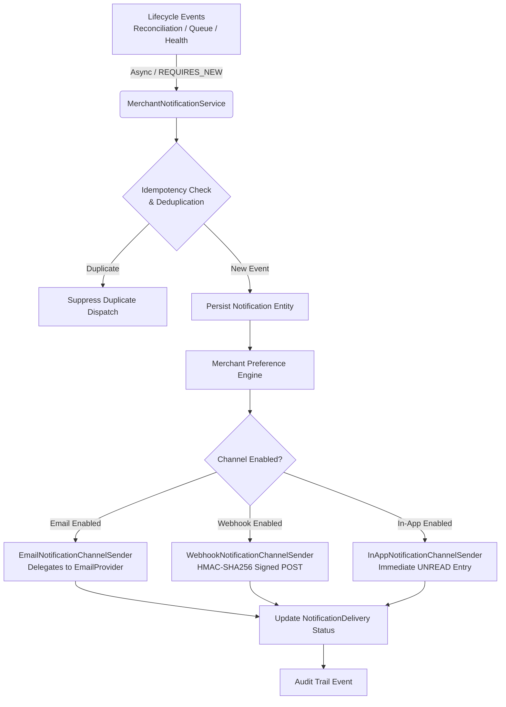

# RecoverAI

RecoverAI is an AI-powered revenue recovery system for failed payment transactions built for the Razorpay Buildathon (Track 3). It autonomously detects at-risk revenue, diagnoses payment failures with Google Gemini (gemini-3.7-flash), applies deterministic safety and compliance policies, executes bounded recovery actions (such as smart retries and personalized payment link generation), measures recovered revenue, and maintains an immutable audit trail.

---

## Tech Stack

### Backend
- **Language & Framework**: Java 21, Spring Boot 3.4.x
- **Security & Authentication**: Spring Security 6, JJWT (io.jsonwebtoken 0.12.x), BCrypt Password Hashing
- **Build Tool**: Maven
- **Persistence & Migration**: Spring Data JPA, PostgreSQL 16, Flyway
- **Observability & Diagnostics**: Spring Boot Actuator
- **Validation**: Hibernate Validator (Spring Boot Starter Validation)

### Frontend
- **Framework & Tooling**: React 19, Vite, TypeScript
- **Styling & UI**: Tailwind CSS v4, Lucide Icons, Recharts (planned)

### AI & Integrations
- **AI Model**: Google Gemini API (`gemini-3.7-flash`)
- **Payment Gateway**: Razorpay API & Webhooks

### Infrastructure & DevOps
- **Containerization**: Docker & Docker Compose
- **Version Control**: Git

---

## Local Setup Prerequisites

- **Java JDK**: Version 21 (JDK 21 LTS required)
- **Node.js**: Version 20+ (with npm 10+)
- **Apache Maven**: Version 3.9+ (or use included `mvnw`)
- **Docker & Docker Compose**: For local PostgreSQL database (optional if running external PostgreSQL)

---

## Environment Variables

Copy `.env.example` to `.env` in the root directory (or configure system environment variables):

```bash
cp .env.example .env
```

### Backend Required Variables
| Variable | Description | Default / Example |
| :--- | :--- | :--- |
| `SERVER_PORT` | HTTP server port | `8080` |
| `CORS_ALLOWED_ORIGINS` | Comma-separated CORS origins | `http://localhost:5173,http://localhost:3000` |
| `DATABASE_URL` | PostgreSQL JDBC connection URL | `jdbc:postgresql://localhost:5432/recoverai` |
| `DATABASE_USERNAME` | PostgreSQL database user | `postgres` |
| `DATABASE_PASSWORD` | PostgreSQL database password | `postgres` |
| `GEMINI_API_KEY` | Google Gemini API key | `<your_gemini_api_key>` |
| `GEMINI_MODEL` | Gemini model identifier | `gemini-3.7-flash` |
| `RAZORPAY_KEY_ID` | Razorpay Key ID | `<your_razorpay_key_id>` |
| `RAZORPAY_KEY_SECRET` | Razorpay Key Secret | `<your_razorpay_key_secret>` |
| `JWT_SECRET` | 256-bit signing key for JWT HMAC-SHA256 tokens | `<your_secure_256_bit_jwt_secret>` |
| `JWT_EXPIRATION_MS` | Access token lifespan in milliseconds | `86400000` (24h) |
| `JWT_ISSUER` | JWT Issuer claim | `RecoverAI` |

### Frontend Required Variables
In `frontend/.env` (or `frontend/.env.example`):
| Variable | Description | Default |
| :--- | :--- | :--- |
| `VITE_API_BASE_URL` | Base URL of the backend API | `http://localhost:8080` |

---

## Getting Started

### 1. Start Local Database (PostgreSQL)

If using Docker Compose:
```bash
docker compose up -d
```
This starts PostgreSQL 16 on port `5432` with database `recoverai`.

### 2. Run Backend (Spring Boot)

Navigate to the `backend` directory and run:
```bash
cd backend
mvn spring-boot:run
```

The backend server will start on port `8080`.
- Health Check: `GET http://localhost:8080/api/v1/health`
- Actuator Health: `GET http://localhost:8080/actuator/health`

### 3. Run Frontend (React + Vite)

In a separate terminal, navigate to the `frontend` directory:
```bash
cd frontend
npm install
npm run dev
```

Open [http://localhost:5173](http://localhost:5173) in your browser.

---

## Running Tests

### Backend Tests
Execute unit and integration tests (including Flyway migration verification and health endpoint tests):
```bash
cd backend
mvn clean test
```

### Frontend Build & Lint
Compile TypeScript and bundle frontend assets:
```bash
cd frontend
npm run build
```

---

---

## Razorpay Webhook Ingestion

RecoverAI includes a multi-tenant webhook ingestion pipeline for Razorpay payment events.

### Endpoint Specification
- **URL**: `POST /api/v1/webhooks/razorpay`
- **Content-Type**: `application/json`
- **Header**: `X-Razorpay-Signature: <hmac_sha256_hex>`

### Supported Events
- `payment.failed`: Persists/updates customer and payment record, deterministically classifies failure category, determines priority based on amount tiers, and creates an `OPEN` `RecoveryCase`.
- `payment.captured`: Updates payment status to `CAPTURED`, records audit event, does not create a recovery case.
- `payment.authorized`: Updates payment status to `AUTHORIZED`.
- `payment.refunded`: Updates payment status to `REFUNDED`.
- *Other Razorpay events*: Safely recorded in `webhook_events` as `IGNORED` and accepted with HTTP 200 without crashing or corrupting state.

### Architecture & Security Guarantees
1. **Constant-Time Signature Verification**: HMAC-SHA256 signature is computed against the raw request body with the merchant's configured webhook secret and compared using `MessageDigest.isEqual` to prevent timing attacks.
2. **Zero Secret Leakage**: Webhook secrets and API keys are never logged, returned in responses, or persisted in audit details.
3. **Multi-Tenant Isolation**: The webhook resolves the merchant via `payload.account_id` matching `merchants.razorpay_account_id`. Signature verification is evaluated exclusively against the resolved merchant's secret.
4. **Idempotency & Duplicate Protection**: Every webhook receipt is hashed (`SHA-256`) and recorded in the `webhook_events` table (Flyway V3 migration). Retried or duplicated events are acknowledged with HTTP 200 `{ "status": "accepted" }` without re-mutating payment or case state.
5. **Deterministic Failure Categorization**:
   - `insufficient_funds`: Balance or limit-related errors
   - `authentication_failure`: 3D Secure, OTP, PIN, 2FA failures
   - `network_error`: Gateway, timeout, server errors
   - `bank_declined`: Issuer bank declines, do not honor
   - `invalid_request`: Bad request or invalid card data
   - `unknown`: Unclassified fallback

---

## Local Webhook Testing Guide

To test the webhook locally:

### 1. Compute HMAC-SHA256 Signature (PowerShell Example)
```powershell
$secret = "your_merchant_webhook_secret"
$body = '{"entity":"event","account_id":"acc_test123","event_id":"evt_001","event":"payment.failed","contains":["payment"],"payload":{"payment":{"entity":{"id":"pay_test_001","entity":"payment","amount":500000,"currency":"INR","status":"failed","order_id":"order_001","method":"card","email":"customer@example.com","contact":"+919876543210","customer_id":"cust_001","error_code":"BAD_REQUEST_ERROR","error_description":"Insufficient funds in account","error_source":"bank","error_reason":"insufficient_funds","created_at":1600000000}}}}'

$hmac = New-Object System.Security.Cryptography.HMACSHA256
$hmac.Key = [System.Text.Encoding]::UTF8.GetBytes($secret)
$hash = $hmac.ComputeHash([System.Text.Encoding]::UTF8.GetBytes($body))
$signature = -join ($hash | ForEach-Object { "{0:x2}" -f $_ })
```

### 2. Send Webhook Request via Curl / Invoke-RestMethod
```powershell
Invoke-RestMethod -Uri "http://localhost:8080/api/v1/webhooks/razorpay" `
  -Method Post `
  -Headers @{ "X-Razorpay-Signature" = $signature; "Content-Type" = "application/json" } `
  -Body $body
```

---

## AI Failure Diagnosis Engine

RecoverAI incorporates an AI-driven failure diagnosis engine powered by Google Gemini (`gemini-3.7-flash`). When a payment failure creates a `RecoveryCase`, the diagnosis engine analyzes the error codes, payment method, risk tier, amount, and failure category to produce a structured, validated recovery recommendation persisted in `AgentDecision`.

### Diagnostic Flow
```
Failed Payment ──► RecoveryCase ──► AIDiagnosisService ──► GeminiClient ──► Structured Output ──► AgentDecision & AuditEvent
```

### Endpoint Specification
- **URL**: `POST /api/v1/recovery-cases/{recoveryCaseId}/diagnose`
- **Header**: `X-Merchant-Id: <uuid>`
- **Alternative URL**: `POST /api/v1/merchants/{merchantId}/recovery-cases/{recoveryCaseId}/diagnose`

### Structured AI Output Schema
```json
{
  "id": "uuid",
  "recoveryCaseId": "uuid",
  "merchantId": "uuid",
  "recommendedAction": "SEND_PAYMENT_LINK | RETRY_CHARGE | SWITCH_PAYMENT_METHOD | MANUAL_INTERVENTION",
  "channel": "WHATSAPP | EMAIL | SMS | RETRY_CHARGE | SMART_LINK | MANUAL",
  "confidenceScore": 0.8850,
  "reasoning": "Detailed diagnostic reasoning",
  "decisionFactors": "{\"primaryReason\":\"insufficient_funds\",\"retryViability\":\"HIGH\"}",
  "modelName": "gemini-3.7-flash",
  "modelVersion": "gemini-3.7-flash-001",
  "promptTokens": 240,
  "completionTokens": 65,
  "createdAt": "2026-08-27T22:45:00Z"
}
```

### Key Guarantees
1. **Multi-Tenant Scoping**: Recovery cases are strictly loaded using merchant-scoped queries (`findByIdAndMerchantId`). Cross-tenant access is rejected with 404/400.
2. **Confidence Score Boundary Validation**: Scores are strictly validated in range `0.0 <= score <= 1.0` before saving.
3. **Structured JSON Mode**: Gemini's `application/json` mode ensures strictly valid JSON structure.
4. **PII Masking**: Customer emails and sensitive identifiers are masked before dispatching context to the LLM.
5. **Zero Credential Exposure**: `GEMINI_API_KEY` is loaded from environment variables and never logged or exposed in exceptions.
6. **Immutable Audit Trail**: Every AI decision is recorded in `audit_events` under `ActorType.AGENT`.

---

## Recovery Orchestration Layer

RecoverAI provides an automated and bounded Recovery Orchestration layer (`RecoveryOrchestratorService`) that consumes AI `AgentDecision` records, evaluates domain lifecycle constraints, safely sequences sequential attempts, and dispatches recovery actions through a clean channel executor abstraction.

### Orchestration Flow
```
RecoveryCase (OPEN) ──► AgentDecision ──► RecoveryOrchestratorService ──► RecoveryActionExecutor ──► RecoveryAttempt & AuditEvent
                                                     │
                                                     ├── Sequences attempt_number (DB-backed)
                                                     ├── Case state: OPEN ➔ IN_PROGRESS
                                                     ├── Attempt state: SCHEDULED ➔ IN_FLIGHT ➔ SENT / SUCCESS / FAILED
                                                     └── Multi-tenant isolation & idempotency guard
```

### Endpoint Specification
- **URL**: `POST /api/v1/recovery-cases/{recoveryCaseId}/orchestrate`
- **Header**: `X-Merchant-Id: <uuid>`
- **Alternative URL**: `POST /api/v1/merchants/{merchantId}/recovery-cases/{recoveryCaseId}/orchestrate`

### Orchestration Response Schema
```json
{
  "id": "uuid",
  "recoveryCaseId": "uuid",
  "merchantId": "uuid",
  "attemptNumber": 1,
  "channel": "WHATSAPP",
  "status": "SENT",
  "scheduledAt": "2026-08-28T00:00:00Z",
  "executedAt": "2026-08-28T00:00:01Z",
  "completedAt": "2026-08-28T00:00:01Z",
  "resultCode": "WHATSAPP_DISPATCHED",
  "resultMessage": "Simulated WhatsApp message dispatched to customer",
  "recoveryLink": "https://pay.recoverai.io/r/{caseId}",
  "createdAt": "2026-08-28T00:00:00Z",
  "updatedAt": "2026-08-28T00:00:01Z"
}
```

### Key Guarantees
1. **DB-Backed Safe Sequencing**: Attempt numbers are sequentially computed from persistent database records (`findTopByRecoveryCaseIdOrderByAttemptNumberDesc`) backed by the database uniqueness constraint `(recovery_case_id, attempt_number)`.
2. **Idempotency & Concurrent Conflict Protection**: Active attempts in `SCHEDULED` or `IN_FLIGHT` state block duplicate orchestration calls (HTTP 409 Conflict).
3. **Lifecycle Management**:
   - `RecoveryCase` transitions from `OPEN` to `IN_PROGRESS` upon initiation.
   - `RecoveryAttempt` transitions from `SCHEDULED` ➔ `IN_FLIGHT` ➔ `SENT` / `SUCCESS` / `FAILED` / `SKIPPED`.
   - On immediate success (e.g. `RETRY_CHARGE`), the case status advances to `RECOVERED`.
4. **Terminal Case Guard**: Cases already in `RECOVERED`, `CANCELLED`, or `EXPIRED` status reject further recovery attempts (HTTP 400 Bad Request).
5. **Channel Executor Abstraction**: `RecoveryActionExecutor` decouples channel dispatch mechanics (`WHATSAPP`, `EMAIL`, `SMS`, `RETRY_CHARGE`, `SMART_LINK`, `MANUAL`) with zero provider-specific API coupling and simulated mock dispatching.
6. **Multi-Tenant Security**: Strict merchant verification on every query; AI raw responses and merchant credentials are never returned in public DTOs.
7. **Audit Trail**: Records structured events (`RECOVERY_ATTEMPT_CREATED`, `RECOVERY_ATTEMPT_STARTED`, `RECOVERY_ATTEMPT_SENT`, `RECOVERY_ATTEMPT_SUCCEEDED`, `RECOVERY_ATTEMPT_FAILED`) under `ActorType.SYSTEM`.

---

## Recovery Communication & Execution Layer

RecoverAI features a modular, extensible communication and recovery execution layer that decouples domain orchestration from external messaging networks (WhatsApp, Email, SMS) and payment gateways (Razorpay).

### Architecture & Provider Abstraction
```
RecoveryOrchestratorService
           │
           ├── WhatsAppRecoveryExecutor  ──► WhatsAppProvider (MockWhatsAppProvider / Twilio / Meta Cloud API)
           ├── EmailRecoveryExecutor     ──► EmailProvider (MockEmailProvider / SendGrid / Postmark)
           ├── SmsRecoveryExecutor       ──► SmsProvider (MockSmsProvider / Twilio / Kaleyra)
           ├── SmartLinkRecoveryExecutor ──► RecoveryLinkService (Configurable Safe URL Generator)
           ├── RetryChargeRecoveryExecutor ─► PaymentRetryProvider (MockPaymentRetryProvider / Razorpay API)
           ├── ManualRecoveryExecutor    ──► RecoveryLinkService (Queued Manual Review)
           └── DefaultRecoveryActionExecutor (Fallback)
```

### Supported Channels & Behavior
| Channel | Executor Class | Underlying Provider | Case Status Transition | Attempt Status |
| :--- | :--- | :--- | :--- | :--- |
| `WHATSAPP` | `WhatsAppRecoveryExecutor` | `WhatsAppProvider` | `OPEN` ➔ `IN_PROGRESS` | `SENT` |
| `EMAIL` | `EmailRecoveryExecutor` | `EmailProvider` | `OPEN` ➔ `IN_PROGRESS` | `SENT` |
| `SMS` | `SmsRecoveryExecutor` | `SmsProvider` | `OPEN` ➔ `IN_PROGRESS` | `SENT` |
| `SMART_LINK` | `SmartLinkRecoveryExecutor` | `RecoveryLinkService` | `OPEN` ➔ `IN_PROGRESS` | `SENT` |
| `RETRY_CHARGE` | `RetryChargeRecoveryExecutor` | `PaymentRetryProvider` | `OPEN` ➔ `RECOVERED` (on success) | `SUCCESS` / `FAILED` |
| `MANUAL` | `ManualRecoveryExecutor` | `RecoveryLinkService` | `OPEN` ➔ `IN_PROGRESS` | `SENT` |

### Local & Test Providers
All communication providers default to safe, deterministic local mock implementations (`MockWhatsAppProvider`, `MockEmailProvider`, `MockSmsProvider`, `MockPaymentRetryProvider`):
- **Zero Real External Calls**: No live messages are dispatched and no live cards are charged during local development or test suite execution.
- **PII-Safe Logging**: Phone numbers and email addresses are masked before writing to server logs (e.g. `+919876****10`, `a***@example.com`).
- **Deterministic Metadata**: Simulated delivery IDs (`mock_wa_...`, `mock_email_...`, `mock_pay_...`) and JSON metadata payloads are returned for full lifecycle verification.

### Safe Recovery Link Generation
The `RecoveryLinkService` generates recovery URLs with configurable base URLs (`recoverai.recovery.base-url`):
- Formats links cleanly as `${baseUrl}${caseId}` without exposing internal secrets, API keys, or raw merchant tokens.
- Supports customizable domain routing in development (`http://localhost:5173/r/`) and production (`https://pay.recoverai.io/r/`).

### Configuration Properties
```yaml
recoverai:
  recovery:
    base-url: ${RECOVERY_BASE_URL:https://pay.recoverai.io/r/}
    whatsapp:
      provider: ${WHATSAPP_PROVIDER:mock}
      sender-number: ${WHATSAPP_SENDER_NUMBER:+14155238886}
      api-key: ${WHATSAPP_API_KEY:}
    email:
      provider: ${EMAIL_PROVIDER:mock}
      from-address: ${EMAIL_FROM_ADDRESS:recover@recoverai.io}
      from-name: ${EMAIL_FROM_NAME:RecoverAI Payment Recovery}
      api-key: ${EMAIL_API_KEY:}
    sms:
      provider: ${SMS_PROVIDER:mock}
      sender-id: ${SMS_SENDER_ID:RECOVER}
      api-key: ${SMS_API_KEY:}
    retry-charge:
      provider: ${RETRY_CHARGE_PROVIDER:mock}
      auto-retry-enabled: ${RETRY_CHARGE_ENABLED:true}
    webhook:
      signature-header: ${RECOVERY_OUTCOME_WEBHOOK_SIGNATURE_HEADER:X-Recovery-Signature}
```

---

## Recovery Outcome Webhooks & Attempt Reconciliation

RecoverAI provides a secure, multi-tenant webhook ingestion layer for asynchronous communication and payment providers to report outcomes for dispatched `RecoveryAttempt` entities.

### Flow Architecture
```
┌─────────────────────────┐
│     AgentDecision       │
└───────────┬─────────────┘
            ▼
┌─────────────────────────┐
│RecoveryOrchestratorSvc  │
└───────────┬─────────────┘
            ▼
┌─────────────────────────┐
│     RecoveryAttempt     │
└───────────┬─────────────┘
            ▼
┌─────────────────────────┐
│   Provider / Executor   │
└───────────┬─────────────┘
            ▼
 [ Asynchronous Outcome ]
            ▼
┌─────────────────────────┐
│POST /api/v1/webhooks/   │
│    recovery-outcome     │
└───────────┬─────────────┘
            ▼
┌─────────────────────────┐
│HMAC-SHA256 Verification │
└───────────┬─────────────┘
            ▼
┌─────────────────────────┐
│  Durable Idempotency    │
│(recovery_outcome_events)│
└───────────┬─────────────┘
            ▼
┌─────────────────────────┐
│  State Machine Valid.   │
│(RecoveryAttemptStateMch)│
└───────────┬─────────────┘
            ▼
┌─────────────────────────┐
│Reconcile RecoveryAttempt│
└───────────┬─────────────┘
            ▼
┌─────────────────────────┐
│ Reconcile RecoveryCase  │
│ (RECOVERED on SUCCESS)  │
└───────────┬─────────────┘
            ▼
┌─────────────────────────┐
│       AuditEvent        │
└─────────────────────────┘
```

### Endpoint Specification
- **URL**: `POST /api/v1/webhooks/recovery-outcome`
- **Content-Type**: `application/json`
- **Headers**:
  - `X-Recovery-Signature: <hmac_sha256_hex>` (or `X-Webhook-Signature`)

#### Sample Request Payload
```json
{
  "providerEventId": "evt_wa_cb_98765",
  "merchantId": "3fa85f64-5717-4562-b3fc-2c963f66afa6",
  "recoveryAttemptId": "7c9e6679-7425-40de-944b-e07fc1f90ae7",
  "outcomeStatus": "SUCCESS",
  "provider": "WHATSAPP",
  "providerReference": "wa_msg_98765",
  "occurredAt": "2026-08-28T18:00:00Z",
  "resultCode": "PAID_VIA_SMART_LINK",
  "resultMessage": "Customer completed payment via smart link",
  "metadata": "{\"paymentMethod\":\"UPI\",\"gatewayPaymentId\":\"pay_test123\"}"
}
```

#### Sample Response Payload
```json
{
  "status": "accepted"
}
```

### State Machine Transition Rules
The `RecoveryAttemptStateMachine` deterministically enforces allowed status lifecycles and forbids backward transitions and mutations to terminal states:
- `SCHEDULED` ➔ `IN_FLIGHT`, `FAILED`, `SKIPPED`
- `IN_FLIGHT` ➔ `SENT`, `DELIVERED`, `CLICKED`, `SUCCESS`, `FAILED`
- `SENT` ➔ `DELIVERED`, `CLICKED`, `SUCCESS`, `FAILED`
- `DELIVERED` ➔ `CLICKED`, `SUCCESS`, `FAILED`
- `CLICKED` ➔ `SUCCESS`, `FAILED`
- Terminal States: `SUCCESS`, `FAILED`, `SKIPPED` (rejects backwards transitions like `SUCCESS` ➔ `IN_FLIGHT`, `FAILED` ➔ `SENT`).

### RecoveryCase Reconciliation & Amount Integrity
- When an attempt transitions to intermediate states (`SENT`, `DELIVERED`, `CLICKED`, `IN_FLIGHT`), `RecoveryCase` remains `IN_PROGRESS`.
- When an attempt transitions to `SUCCESS`:
  - `RecoveryAttempt` status is set to `SUCCESS`, `completedAt` populated.
  - `RecoveryCase` transitions to `RECOVERED`, `recoveredAt` populated.
  - `recoveredAmount` is derived from trusted persistent data (`estimatedRecoverableAmount`), preventing external client/webhook manipulation.
  - Associated `Payment` status is updated to `CAPTURED`.
- When an attempt transitions to `FAILED`:
  - `RecoveryAttempt` status is set to `FAILED`, `completedAt` populated.
  - `RecoveryCase` remains `IN_PROGRESS` (not recovered) so future attempts can be scheduled.

### Multi-Tenant Isolation & Concurrency Safety
1. **Tenant Authorization**: Lookups are strictly merchant-scoped (`findByIdAndMerchantId`). Webhooks signed for Merchant A can never read or mutate Merchant B's attempts, cases, or payments (returns HTTP 404 with safe error details).
2. **Durable Idempotency**: Persistent `recovery_outcome_events` table (Flyway V4 migration) with unique constraint `(merchant_id, provider, provider_event_id)`.
3. **Concurrent Duplicate Protection**: If two identical webhook deliveries arrive concurrently, the database unique constraint prevents duplicate processing; subsequent deliveries return HTTP 200 `{ "status": "accepted" }` and emit `RECOVERY_OUTCOME_DUPLICATE` audit events without duplicate mutations.

### Audit Events
Structured audit logging via `AuditService` (`ActorType.WEBHOOK`):
- `RECOVERY_OUTCOME_RECEIVED`
- `RECOVERY_OUTCOME_PROCESSED`
- `RECOVERY_OUTCOME_DUPLICATE`
- `RECOVERY_OUTCOME_REJECTED`
- `RECOVERY_ATTEMPT_STATUS_UPDATED`
- `RECOVERY_ATTEMPT_SUCCEEDED`
- `RECOVERY_ATTEMPT_FAILED`

---

---

## Recovery Scheduling & Automated Background Poller

RecoverAI provides an automated and resilient Recovery Scheduling system (`RecoverySchedulerService`, `RecoverySchedulerWorker`) that allows recovery attempts to be planned for future execution or queued for immediate background processing.

### Architecture & Polling Lifecycle
```
┌────────────────────────────────────────────────────────┐
│  POST /api/v1/recovery-cases/{id}/schedule             │
│  Payload: { "scheduledAt": "2026-08-28T19:30:00Z" }    │
└─────────────────────────┬──────────────────────────────┘
                          │
                          ▼
┌────────────────────────────────────────────────────────┐
│  RecoverySchedulerService.scheduleRecovery             │
│  - Multi-tenant ownership check                        │
│  - Guard against terminal cases (RECOVERED, etc.)      │
│  - Idempotency check for active attempts               │
│  - Sequential attempt numbering                        │
│  - Case state: OPEN ➔ IN_PROGRESS                      │
│  - Persist RecoveryAttempt in SCHEDULED status         │
└────────────────────────────────────────────────────────┘
                          │
                          ▼
┌────────────────────────────────────────────────────────┐
│  Periodic Background Worker (@Scheduled)               │
│  RecoverySchedulerWorker (Fixed delay: 5000ms)         │
└─────────────────────────┬──────────────────────────────┘
                          │
                          ▼
┌────────────────────────────────────────────────────────┐
│  RecoverySchedulerService.pollAndExecuteDueAttempts    │
│  - Queries DB for due SCHEDULED attempts (idx_status_  │
│    scheduled_at composite index)                       │
│  - Atomic claim: SCHEDULED ➔ IN_FLIGHT                 │
│  - Prevents race conditions across clustered nodes     │
│  - Terminal case guard (skips if case already solved)  │
│  - Dispatches to RecoveryActionExecutor                │
│  - Reconciles case to RECOVERED on immediate success   │
│  - Emits immutable AuditEvents                         │
└────────────────────────────────────────────────────────┘
```

### Endpoints Specification
- **URL**: `POST /api/v1/recovery-cases/{recoveryCaseId}/schedule`
  - **Header**: `X-Merchant-Id: <uuid>`
- **Alternative URL**: `POST /api/v1/merchants/{merchantId}/recovery-cases/{recoveryCaseId}/schedule`

#### Request Payload
```json
{
  "scheduledAt": "2026-08-28T19:30:00Z"
}
```
*Note: `scheduledAt` is optional. If omitted or null, it defaults to the current timestamp (`Instant.now()`).*

#### Response Payload (201 Created)
```json
{
  "id": "uuid",
  "recoveryCaseId": "uuid",
  "merchantId": "uuid",
  "attemptNumber": 1,
  "channel": "WHATSAPP",
  "status": "SCHEDULED",
  "scheduledAt": "2026-08-28T19:30:00Z",
  "executedAt": null,
  "completedAt": null,
  "resultCode": null,
  "resultMessage": null,
  "recoveryLink": null,
  "metadata": "{\"agentDecisionId\":\"...\",\"recommendedAction\":\"WHATSAPP_SMART_LINK\"}",
  "createdAt": "2026-08-28T18:00:00Z",
  "updatedAt": "2026-08-28T18:00:00Z"
}
```

### Concurrency, Idempotency & Clustering Strategy
1. **Composite Index Polling**: Flyway migration `V5__create_recovery_scheduler_index.sql` adds a composite index on `recovery_attempts(status, scheduled_at)` to ensure high-performance polling under heavy volumes.
2. **Atomic DB-Level Claiming**: Claiming is executed via an atomic update query:
   ```sql
   UPDATE recovery_attempts
   SET status = 'IN_FLIGHT', executed_at = :now, updated_at = :now
   WHERE id = :id AND status = 'SCHEDULED'
   ```
   In a clustered multi-node deployment, only the single worker that receives `rowsUpdated == 1` proceeds with execution. All competing workers receive `0` and safely yield, guaranteeing zero duplicate dispatches.
3. **Isolated Subtransactions**: Execution for each attempt is isolated in a separate transaction (`Propagation.REQUIRES_NEW`), ensuring an unexpected failure during one attempt's execution never aborts the overall polling batch or other attempts.
4. **Terminal Case Guarding**: If a recovery case transitions to a terminal state (`RECOVERED`, `CANCELLED`, `EXPIRED`) while waiting in `SCHEDULED` status, the claiming service detects this prior to execution, marks the attempt `SKIPPED` with result code `CASE_TERMINAL`, and prevents unnecessary customer communication or payment retries.
5. **Multi-Tenant Security**: Strict merchant ownership is verified during scheduling (`findByIdAndMerchantId`). Attempt entities inherit the merchant identifier and all audit events are scoped to the merchant.

### Configuration Properties
| Property | Environment Variable | Default | Description |
| :--- | :--- | :--- | :--- |
| `recoverai.recovery.scheduler.enabled` | `RECOVERY_SCHEDULER_ENABLED` | `true` | Enables or disables background polling worker |
| `recoverai.recovery.scheduler.polling-interval-ms` | `RECOVERY_SCHEDULER_POLLING_INTERVAL_MS` | `5000` | Polling cycle delay in milliseconds |
| `recoverai.recovery.scheduler.batch-size` | `RECOVERY_SCHEDULER_BATCH_SIZE` | `50` | Maximum number of due attempts claimed per cycle |

---

## Merchant Authentication & JWT Security

RecoverAI features a production-grade merchant authentication and authorization subsystem built on **Spring Security 6**, **JJWT (io.jsonwebtoken 0.12.x)**, and **BCrypt password hashing**. It replaces untrusted `X-Merchant-Id` header authentication with cryptographically signed JSON Web Tokens (JWT) while strictly preserving multi-tenant isolation.

```
                    ┌─────────────────────────┐
                    │ Merchant Client / UI    │
                    └───────────┬─────────────┘
                                │
        1. POST /api/v1/auth/login (email + password)
                                │
                                ▼
                    ┌─────────────────────────┐
                    │       AuthService       │
                    │ - BCrypt match password │
                    │ - Issue signed JWT      │
                    └───────────┬─────────────┘
                                │
              2. Returns Bearer Access Token (JWT)
                                │
                                ▼
   3. Requests with `Authorization: Bearer <jwt>`
                                │
                                ▼
                    ┌─────────────────────────┐
                    │ JwtAuthenticationFilter │
                    │ - Verify HMAC signature │
                    │ - Verify expiration     │
                    │ - Set MerchantPrincipal │
                    └───────────┬─────────────┘
                                │
                                ▼
         ┌──────────────────────────────────────────────────┐
         │ Multi-Tenant Protected Business Endpoints        │
         │ - Auth merchant ID from JWT is authoritative     │
         │ - Header/path spoofing rejected (403 Forbidden)  │
         │ - Repository queries scoped to merchant          │
         └──────────────────────────────────────────────────┘
```

### Endpoints Specification

#### 1. Merchant Registration
- **URL**: `POST /api/v1/auth/register`
- **Access**: Public

##### Request Body
```json
{
  "name": "Acme Retailers Pvt Ltd",
  "email": "payments@acmeretail.com",
  "password": "StrongPassword123!",
  "razorpayAccountId": "acc_123456789",
  "webhookSecret": "whsec_customsecret"
}
```
*Note: `razorpayAccountId` and `webhookSecret` are optional. If `webhookSecret` is omitted, a cryptographically secure secret is generated automatically.*

##### Response Body (`201 Created`)
```json
{
  "id": "78328114-68f4-411a-85b4-d5ebdb932371",
  "name": "Acme Retailers Pvt Ltd",
  "email": "payments@acmeretail.com",
  "razorpayAccountId": "acc_123456789",
  "status": "ACTIVE",
  "createdAt": "2026-08-28T18:00:00Z",
  "updatedAt": "2026-08-28T18:00:00Z"
}
```
*Sensitive fields like `passwordHash` and `webhookSecret` are never exposed in response DTOs.*

---

#### 2. Merchant Login
- **URL**: `POST /api/v1/auth/login`
- **Access**: Public

##### Request Body
```json
{
  "email": "payments@acmeretail.com",
  "password": "StrongPassword123!"
}
```

##### Response Body (`200 OK`)
```json
{
  "token": "eyJhbGciOiJIUzI1NiJ9.eyJpc3MiOiJSZWNvdmVyQUkiLCJzdWIiOiI3ODMyODExNC02OGY0LTQxMWEtODViNC1kNWViZGI5MzIzNzEiLCJtZXJjaGFudElkIjoiNzgzMjgxMTQtNjhmNC00MTFhLTg1YjQtZDVlYmRiOTMyMzcxIiwiZW1haWwiOiJwYXltZW50c0BhY21lcmV0YWlsLmNvbSIsIm5hbWUiOiJBY21lIFJldGFpbGVycyBQdnQgTHRkIiwicm9sZSI6IlJPTEVfTUVSQ0hBTlQiLCJpYXQiOjE3NTY0MDY0MDAsImV4cCI6MTc1NjQ5MjgwMH0.signature",
  "tokenType": "Bearer",
  "expiresInMs": 86400000,
  "merchant": {
    "id": "78328114-68f4-411a-85b4-d5ebdb932371",
    "name": "Acme Retailers Pvt Ltd",
    "email": "payments@acmeretail.com",
    "razorpayAccountId": "acc_123456789",
    "status": "ACTIVE",
    "createdAt": "2026-08-28T18:00:00Z",
    "updatedAt": "2026-08-28T18:00:00Z"
  }
}
```

---

### Protected APIs & Authorization Header Format

All business APIs require the JWT token to be supplied in the standard HTTP header:
```http
Authorization: Bearer <jwt-token>
```

| Endpoint Path | Method | Access Level | Description |
| :--- | :--- | :--- | :--- |
| `/api/v1/auth/register` | `POST` | Public | Merchant registration |
| `/api/v1/auth/login` | `POST` | Public | Merchant authentication & JWT issuance |
| `/api/v1/health` | `GET` | Public | Application health check |
| `/actuator/health` | `GET` | Public | Spring Boot Actuator health probe |
| `/api/v1/webhooks/razorpay` | `POST` | Public (HMAC Verified) | Razorpay payment failure ingestion (via `X-Razorpay-Signature`) |
| `/api/v1/webhooks/recovery-outcome` | `POST` | Public (HMAC Verified) | Recovery outcome callback (via `X-Recovery-Signature`) |
| `/api/v1/recovery-cases/{id}/diagnose` | `POST` | Authenticated | Trigger AI diagnosis for a case |
| `/api/v1/recovery-cases/{id}/orchestrate` | `POST` | Authenticated | Trigger immediate recovery execution |
| `/api/v1/recovery-cases/{id}/schedule` | `POST` | Authenticated | Schedule a recovery attempt |

---

### Security Architecture & Design Decisions

1. **Deterministic Multi-Tenant Scoping**:
   - The authenticated merchant ID extracted from the validated JWT token is the **authoritative identity**.
   - If a client provides an explicit `X-Merchant-Id` header or path variable `/merchants/{merchantId}/...` that belongs to a *different* merchant, the system rejects the request immediately with **403 Forbidden** (`TenantMismatchException`).
   - Repository queries remain strictly tenant-scoped (e.g. `findByIdAndMerchantId`).
2. **Password Security**:
   - Passwords are encrypted using Spring Security's `BCryptPasswordEncoder` with a secure cost factor.
   - Plaintext passwords are never stored in the database or logged in application logs.
   - Salting is handled automatically and uniquely per hash.
3. **JWT Cryptographic Integrity**:
   - Signed using HMAC-SHA256 with a 256-bit secret key.
   - Token payload includes `sub` (Merchant ID), `merchantId`, `email`, `name`, `role`, `iat`, `exp`, and `iss`.
   - Tampered, expired, or malformed tokens are intercepted by `JwtAuthenticationFilter` and rejected with `401 Unauthorized`.
4. **Webhook Security Distinction**:
   - Webhook endpoints (`/api/v1/webhooks/**`) remain open to external automated callers (Razorpay gateway and recovery delivery providers) without requiring merchant JWT access tokens.
   - Webhooks are protected via constant-time HMAC-SHA256 signature verification (`X-Razorpay-Signature`, `X-Recovery-Signature`) against each merchant's secret.
5. **Standardized Error Handling**:
   - Authentication errors (`InvalidCredentialsException`, `AuthenticationException`) return standardized JSON `ApiErrorResponse` (`401 Unauthorized`).
   - Authorization failures return `403 Forbidden`.
   - Duplicate registrations return `409 Conflict`.
   - Internal credentials, secrets, and stack traces are never exposed in error responses.

---

### JWT Security Configuration Properties
| Property | Environment Variable | Default | Description |
| :--- | :--- | :--- | :--- |
| `recoverai.security.jwt.secret` | `JWT_SECRET` | *Configurable secret* | 256-bit secret key for HMAC-SHA256 signing |
| `recoverai.security.jwt.expiration-ms` | `JWT_EXPIRATION_MS` | `86400000` (24 hours) | JWT access token validity duration in ms |
| `recoverai.security.jwt.issuer` | `JWT_ISSUER` | `RecoverAI` | Issuer claim embedded in generated tokens |

---

---

## Merchant Dashboard & Recovery Management APIs

RecoverAI provides merchant-scoped recovery case management and dashboard metrics.

### Endpoints Specification

| Endpoint Path | Method | Access Level | Description |
| :--- | :--- | :--- | :--- |
| `/api/v1/dashboard/summary` | `GET` | Authenticated | High-level merchant summary metrics |
| `/api/v1/recovery-cases` | `GET` | Authenticated | Paginated and filtered list of merchant recovery cases |
| `/api/v1/recovery-cases/{id}` | `GET` | Authenticated | Detailed recovery case information with attempts and AI diagnosis |
| `/api/v1/recovery-cases/{id}/attempts` | `GET` | Authenticated | Ordered history of recovery attempts for a case |
| `/api/v1/recovery-cases/{id}/cancel` | `PATCH` | Authenticated | Cancel an open or in-progress recovery case and skip scheduled attempts |

---

## Recovery Analytics & Reporting Engine

RecoverAI features a production-ready, merchant-scoped recovery analytics and reporting engine providing deep insights into recovery metrics, daily performance trends, payment failure reasons, communication channel efficacy, and recovery attempt breakdowns.

### Analytics Endpoints

| Endpoint Path | Method | Access Level | Description |
| :--- | :--- | :--- | :--- |
| `/api/v1/analytics/overview` | `GET` | Authenticated | Comprehensive recovery KPIs and average recovery time |
| `/api/v1/analytics/recovery-trends` | `GET` | Authenticated | Daily periodic trends of cases, at-risk volume, recovered amounts, and recovery rate |
| `/api/v1/analytics/failures` | `GET` | Authenticated | Revenue risk & recovery analytics grouped by failure category and priority |
| `/api/v1/analytics/channels` | `GET` | Authenticated | Conversion, delivery, and success metrics grouped by recovery channel |
| `/api/v1/analytics/attempts` | `GET` | Authenticated | Status breakdown, channel distribution, and average attempts per recovery case |

### Common Request Parameters

All analytics endpoints support optional date-range filtering:

| Parameter | Type | In | Description | Default |
| :--- | :--- | :--- | :--- | :--- |
| `from` | `String` | Query | Start date/time (ISO-8601 format: `YYYY-MM-DD` or `YYYY-MM-DDTHH:mm:ssZ`) | 30 days prior to `to` |
| `to` | `String` | Query | End date/time (ISO-8601 format: `YYYY-MM-DD` or `YYYY-MM-DDTHH:mm:ssZ`) | Current timestamp (`now`) |
| `Authorization` | `String` | Header | Bearer JWT access token (`Bearer <jwt>`) | **Required** |
| `X-Merchant-Id` | `UUID` | Header | Optional explicit merchant ID (validated against JWT token) | Authenticated Merchant ID |

### Date Range Validation Rules
1. **Sensible Defaults**: If both `from` and `to` are omitted, a 30-day window (`[now - 30 days, now]`) is applied automatically.
2. **Flexible Formats**: Accepts both ISO-8601 date strings (`2026-08-01`) and full UTC timestamps (`2026-08-01T00:00:00Z`).
3. **Range Constraints**:
   - `from` must be before or equal to `to`. If `from > to`, returns **HTTP 400 Bad Request**.
   - Maximum date span cannot exceed **365 days** to prevent expensive unbounded queries.
   - Invalid formats return **HTTP 400 Bad Request** with a descriptive `ApiErrorResponse`.

---

### Endpoint Details & Response Structures

#### 1. Recovery Analytics Overview
- **URL**: `GET /api/v1/analytics/overview`
- **Description**: Returns top-level KPIs including case distributions, monetary totals, recovery rate, average recovered amount, and average time to recovery.

##### Sample Response (`200 OK`)
```json
{
  "totalCases": 50,
  "openCases": 10,
  "inProgressCases": 15,
  "recoveredCases": 20,
  "failedCases": 2,
  "expiredCases": 2,
  "cancelledCases": 1,
  "expiredOrCancelledCases": 3,
  "totalEstimatedRecoverableAmount": 150000.00,
  "totalRecoveredAmount": 65000.00,
  "recoveryRate": 40.00,
  "averageRecoveredAmount": 3250.00,
  "averageTimeToRecoverySeconds": 4320.00,
  "from": "2026-07-29T14:00:00Z",
  "to": "2026-08-28T14:00:00Z"
}
```

---

#### 2. Recovery Trend Analytics
- **URL**: `GET /api/v1/analytics/recovery-trends`
- **Description**: Returns daily recovery volume, at-risk capital, recovered amounts, and daily recovery rate aggregated at the database level with deterministic ascending date ordering.

##### Sample Response (`200 OK`)
```json
{
  "from": "2026-08-01T00:00:00Z",
  "to": "2026-08-28T23:59:59.999Z",
  "totalCases": 25,
  "totalAmountAtRisk": 75000.00,
  "totalRecoveredAmount": 35000.00,
  "overallRecoveryRate": 46.67,
  "trends": [
    {
      "date": "2026-08-01",
      "recoveryCasesCreated": 5,
      "amountAtRisk": 15000.00,
      "amountRecovered": 7500.00,
      "recoveredCaseCount": 3,
      "recoveryRate": 60.00
    },
    {
      "date": "2026-08-02",
      "recoveryCasesCreated": 8,
      "amountAtRisk": 24000.00,
      "amountRecovered": 12000.00,
      "recoveredCaseCount": 4,
      "recoveryRate": 50.00
    }
  ]
}
```

---

#### 3. Failure Analytics
- **URL**: `GET /api/v1/analytics/failures`
- **Description**: Groups payment failures by `failureReasonCategory` and `priority` to help merchants identify which root causes represent the highest revenue risk.

##### Sample Response (`200 OK`)
```json
{
  "from": "2026-07-29T14:00:00Z",
  "to": "2026-08-28T14:00:00Z",
  "totalCases": 40,
  "categories": [
    {
      "failureReasonCategory": "INSUFFICIENT_FUNDS",
      "caseCount": 20,
      "estimatedRecoverableAmount": 60000.00,
      "recoveredAmount": 30000.00,
      "recoveredCaseCount": 10,
      "recoveryRate": 50.00
    },
    {
      "failureReasonCategory": "AUTHENTICATION_ERROR",
      "caseCount": 15,
      "estimatedRecoverableAmount": 45000.00,
      "recoveredAmount": 22500.00,
      "recoveredCaseCount": 8,
      "recoveryRate": 53.33
    }
  ],
  "priorities": [
    {
      "priority": "CRITICAL",
      "caseCount": 10,
      "estimatedRecoverableAmount": 50000.00,
      "recoveredAmount": 35000.00,
      "recoveredCaseCount": 7,
      "recoveryRate": 70.00
    },
    {
      "priority": "HIGH",
      "caseCount": 20,
      "estimatedRecoverableAmount": 40000.00,
      "recoveredAmount": 15000.00,
      "recoveredCaseCount": 8,
      "recoveryRate": 40.00
    }
  ]
}
```

---

#### 4. Channel Performance Analytics
- **URL**: `GET /api/v1/analytics/channels`
- **Description**: Analyzes recovery attempts per communication channel (`WHATSAPP`, `EMAIL`, `SMS`, `RETRY_CHARGE`, `SMART_LINK`, `MANUAL`) measuring total dispatches, deliveries, clicks, success rate, and attributable recovered revenue.

##### Sample Response (`200 OK`)
```json
{
  "from": "2026-07-29T14:00:00Z",
  "to": "2026-08-28T14:00:00Z",
  "totalAttempts": 80,
  "channels": [
    {
      "channel": "WHATSAPP",
      "totalAttempts": 45,
      "successfulAttempts": 25,
      "failedAttempts": 5,
      "sentAttempts": 10,
      "deliveredAttempts": 5,
      "clickedAttempts": 0,
      "successRate": 55.56,
      "recoveredAmount": 52000.00
    },
    {
      "channel": "EMAIL",
      "totalAttempts": 25,
      "successfulAttempts": 8,
      "failedAttempts": 7,
      "sentAttempts": 8,
      "deliveredAttempts": 2,
      "clickedAttempts": 0,
      "successRate": 32.00,
      "recoveredAmount": 18000.00
    },
    {
      "channel": "RETRY_CHARGE",
      "totalAttempts": 10,
      "successfulAttempts": 6,
      "failedAttempts": 4,
      "sentAttempts": 0,
      "deliveredAttempts": 0,
      "clickedAttempts": 0,
      "successRate": 60.00,
      "recoveredAmount": 12000.00
    }
  ]
}
```

---

#### 5. Recovery Attempt Analytics
- **URL**: `GET /api/v1/analytics/attempts`
- **Description**: Comprehensive breakdown of recovery attempts by lifecycle status and channel, including calculation of average attempts per recovery case.

##### Sample Response (`200 OK`)
```json
{
  "from": "2026-07-29T14:00:00Z",
  "to": "2026-08-28T14:00:00Z",
  "totalAttempts": 80,
  "successfulAttempts": 39,
  "failedAttempts": 16,
  "scheduledAttempts": 10,
  "inFlightAttempts": 3,
  "sentAttempts": 8,
  "deliveredAttempts": 4,
  "clickedAttempts": 0,
  "skippedAttempts": 0,
  "successRate": 48.75,
  "averageAttemptsPerRecoveryCase": 1.60,
  "attemptsByStatus": {
    "SCHEDULED": 10,
    "IN_FLIGHT": 3,
    "SENT": 8,
    "DELIVERED": 4,
    "CLICKED": 0,
    "SUCCESS": 39,
    "FAILED": 16,
    "SKIPPED": 0
  },
  "attemptsByChannel": {
    "WHATSAPP": 45,
    "EMAIL": 25,
    "SMS": 0,
    "RETRY_CHARGE": 10,
    "SMART_LINK": 0,
    "MANUAL": 0
  }
}
```

---

### Security & Multi-Tenant Isolation Guarantees

1. **JWT Authentication Required**: All analytics endpoints require a valid JWT bearer token. Unauthenticated requests are rejected with **HTTP 401 Unauthorized**.
2. **Tenant Scoping from Security Context**: Merchant identity is always resolved authoritatively from `SecurityUtils.getCurrentMerchantId()`.
3. **Anti-Spoofing Protection**: Any mismatch between the authenticated merchant and supplied headers/parameters immediately yields **HTTP 403 Forbidden**.
4. **Database-Level Isolation**: Every SQL/JPQL aggregation strictly enforces `WHERE rc.merchant.id = :merchantId` or `WHERE ra.merchant.id = :merchantId`.
5. **High-Performance Aggregations**: All analytics metrics are computed via database-level `SUM`, `COUNT`, `AVG`, and `GROUP BY` projections without loading entire entity graphs into memory. Composite indexes (Flyway V7 & V8) accelerate multi-tenant analytics filtering.

---

---

## Recovery Strategy Engine

The **Deterministic Recovery Strategy Engine** (`RecoveryStrategyEngine`, `RecoveryStrategyService`, `RecoveryStrategyController`) consumes the raw AI diagnosis (`AgentDecision`), payment failure telemetry, previous attempt history, customer contact availability, and configurable business policies to produce a deterministic, safe, and auditable **Recovery Strategy** before any attempt execution or scheduling.

```
+---------------------+
|   AI Diagnosis      |  Produces probabilistic AgentDecision
| (Gemini 3.7 Flash)  |  (recommendedAction, channel, confidenceScore)
+----------+----------+
           |
           v
+---------------------+
|  Recovery Strategy  |  Deterministic Policy Enforcement:
|       Engine        |  - Terminal Case Protection (RECOVERED/CANCELLED/EXPIRED)
|                     |  - High/Low Confidence Thresholding
+----------+----------+  - Failure Category Eligibility (insufficient_funds, network_error vs auth/invalid)
           |             - Customer Contact Channel Viability (Phone/Email availability)
           |             - Previous Attempt & Failure History / Fallback Cascading
           |             - Configurable Max Attempts Limit Guard
           v
+---------------------+
|  RecoveryStrategy   |  Persisted in PostgreSQL (Flyway V9 `recovery_strategies`)
|     (Persisted)     |  Immutable audit record with chosen channel, priority, delay, fallback
+----------+----------+
           |
           +----------------------------------+
           |                                  |
           v                                  v
+-----------------------+          +----------------------+
| Recovery Orchestrator |          |  Recovery Scheduler  |
|      Service          |          |       Service        |
+----------+------------+          +----------+-----------+
           |                                  |
           +-----------------+----------------+
                             |
                             v
               +---------------------------+
               |  RecoveryActionExecutors  |
               | (WhatsApp, Email, SMS,    |
               |  SmartLink, RetryCharge)  |
               +---------------------------+
```

### Deterministic Strategy Policy Rules

1. **Terminal Case Guarding**:
   - If a recovery case is already `RECOVERED`, `CANCELLED`, or `EXPIRED`, or its underlying payment is `CAPTURED` or `REFUNDED`, the engine outputs a terminal strategy (`isTerminal = true`, action `NO_ACTION_TERMINAL`).
   - Prevents any further scheduling or execution on completed cases.

2. **Maximum Attempts Enforcement**:
   - Compares total prior recovery attempts against `recoverai.recovery.strategy.max-attempts` (default: 3).
   - If the limit is reached, a terminal strategy is generated (`isTerminal = true`, action `MAX_ATTEMPTS_EXCEEDED`), preventing duplicate or infinite attempt storms.

3. **AI Confidence Thresholding**:
   - Evaluates `AgentDecision.confidenceScore` against `recoverai.recovery.strategy.min-ai-confidence` (default: `0.70`).
   - **Low Confidence (< 0.70)**: Automatically avoids automated payment re-charges (`RETRY_CHARGE`) and switches to conservative customer communication channels (`WHATSAPP` -> `EMAIL` -> `SMS` -> `SMART_LINK` -> `MANUAL`).

4. **Payment Retry Charge Eligibility**:
   - `RETRY_CHARGE` is only permitted when:
     - `retry-charge-enabled` is `true`.
     - AI confidence is sufficiently high (`>= 0.70`).
     - Payment failure category is technically recoverable (e.g. `insufficient_funds`, `network_error`, `system_error`, `temporary_technical_issue`, `timeout`).
     - Permanent/fatal failure categories (e.g. `authentication_failure`, `card_expired`, `invalid_request`, `bank_declined`, `fraud_suspected`) strictly prohibit automated re-charging.
     - `RETRY_CHARGE` has not already been attempted previously for this case (capped at 1 retry charge attempt).

5. **Customer Contact Availability & Viability**:
   - `WHATSAPP` and `SMS`: Require a valid customer phone number (`customer.phone`).
   - `EMAIL`: Requires a valid customer email address (`customer.email`).
   - `SMART_LINK`: Requires either phone or email for link delivery.
   - `MANUAL`: Fallback when no automated communication channels or contact information are present.

6. **Channel Failure Cascading & Fallbacks**:
   - Tracks failed attempts per channel. Channels exceeding `max-channel-failures` (default: 1) are marked exhausted.
   - Fallback hierarchy: `WHATSAPP` -> `EMAIL` -> `SMS` -> `SMART_LINK` -> `MANUAL`.
   - Strategies persist designated `fallbackChannel` and `fallbackAction` for downstream recovery resilience.

---

### Configuration Properties

| Property | Environment Variable | Default | Description |
| :--- | :--- | :--- | :--- |
| `recoverai.recovery.strategy.enabled` | `RECOVERY_STRATEGY_ENABLED` | `true` | Enable/disable deterministic strategy engine |
| `recoverai.recovery.strategy.min-ai-confidence` | `RECOVERY_STRATEGY_MIN_AI_CONFIDENCE` | `0.70` | Minimum confidence score required for aggressive strategies |
| `recoverai.recovery.strategy.max-attempts` | `RECOVERY_STRATEGY_MAX_ATTEMPTS` | `3` | Maximum allowed recovery attempts per case |
| `recoverai.recovery.strategy.retry-charge-enabled` | `RECOVERY_STRATEGY_RETRY_CHARGE_ENABLED` | `true` | Allow automated payment re-charging when eligible |
| `recoverai.recovery.strategy.fallback-enabled` | `RECOVERY_STRATEGY_FALLBACK_ENABLED` | `true` | Enable automatic channel fallback calculation |
| `recoverai.recovery.strategy.max-channel-failures` | `RECOVERY_STRATEGY_MAX_CHANNEL_FAILURES` | `1` | Max failures on a single channel before switching |
| `recoverai.recovery.strategy.default-delay-seconds` | `RECOVERY_STRATEGY_DEFAULT_DELAY_SECONDS` | `0` | Default execution delay for communication channels |
| `recoverai.recovery.strategy.retry-delay-seconds` | `RECOVERY_STRATEGY_RETRY_DELAY_SECONDS` | `300` | Execution delay (seconds) for payment retry charges |

---

### Strategy API Endpoints

#### 1. Generate Strategy
- **URL**: `POST /api/v1/recovery-cases/{id}/strategy` (or `POST /api/v1/merchants/{merchantId}/recovery-cases/{id}/strategy`)
- **Security**: JWT Bearer Token required
- **Description**: Evaluates the recovery case and persists a new `RecoveryStrategy`.

##### Sample Response (`200 OK`)
```json
{
  "id": "e4b1b34a-939a-4c28-98e2-9d32bb58231a",
  "recoveryCaseId": "2ba82602-6028-47f7-ade2-12a0ba189736",
  "merchantId": "1a2b3c4d-5e6f-7a8b-9c0d-1e2f3a4b5c6d",
  "channel": "RETRY_CHARGE",
  "recommendedAction": "RETRY_CHARGE",
  "priority": "HIGH",
  "delaySeconds": 300,
  "maxAttempts": 3,
  "confidenceScore": 0.8800,
  "reason": "AI recommended RETRY_CHARGE with high confidence (0.8800) and retry eligibility satisfied.",
  "fallbackChannel": "WHATSAPP",
  "fallbackAction": "SEND_WHATSAPP_REMINDER",
  "terminal": false,
  "createdAt": "2026-08-28T14:30:00Z"
}
```

#### 2. Get Latest Strategy
- **URL**: `GET /api/v1/recovery-cases/{id}/strategy` (or `GET /api/v1/merchants/{merchantId}/recovery-cases/{id}/strategy`)
- **Security**: JWT Bearer Token required
- **Description**: Retrieves the most recently computed and persisted recovery strategy for the specified recovery case.

---

### Audit Logging Events

All strategy evaluations are recorded to the immutable `audit_events` log with `ActorType.SYSTEM` and `actorId = "RecoveryStrategyEngine"`:
- `RECOVERY_STRATEGY_GENERATED`: Successfully created actionable strategy.
- `RECOVERY_STRATEGY_FALLBACK`: Fallback channel selected due to contact/failure constraints.
- `RECOVERY_STRATEGY_TERMINAL`: Terminal case or max attempts limit encountered.
---

## Strategy-Driven Recovery Execution Integration (PR #13)

The Strategy-Driven Recovery Execution Integration layer establishes the Deterministic Recovery Strategy Engine as the authoritative policy decision for all recovery execution workflows across both synchronous orchestration and asynchronous background scheduling.

### Key Architectural Concepts

1. **Strategy-Driven Authority**:
   - Recovery execution flows (`/orchestrate` and `/schedule`) strictly resolve the latest valid merchant-scoped `RecoveryStrategy`.
   - AI recommendations (`AgentDecision`) serve as inputs to the Strategy Engine; the engine synthesizes AI confidence, contact viability, payment retry eligibility, and previous attempt failures into an executable policy.
   - If no strategy exists or an existing strategy is stale/unviable, the system automatically and deterministically generates and persists a fresh strategy before execution.

2. **Immutable Strategy Execution Snapshot**:
   - Each `RecoveryAttempt` persists a safe, immutable snapshot (`strategy_snapshot` JSON and `strategy_id` FK reference) of the strategy that generated it.
   - Snapshot fields: `strategyId`, `channel`, `recommendedAction`, `confidenceScore`, `priority`, `fallbackChannel`, `fallbackAction`, `reason`.
   - Sensitive credentials, API keys, raw Gemini prompts, and cardholder data are strictly excluded from snapshots and audit logs.

3. **Fallback & Retry Protection**:
   - When channel execution fails, the strategy's configured fallback channel is evaluated for subsequent attempts.
   - Immediate retries of failed channels are prevented; subsequent attempts respect configured channel failure limits and maximum attempt bounds, preventing infinite fallback loops.
   - Every fallback selection is recorded in the immutable audit log (`RECOVERY_STRATEGY_FALLBACK_SELECTED`).

4. **Background Worker Consistency**:
   - Background scheduler workers (`RecoverySchedulerWorker`) claim scheduled attempts atomically and execute the exact persisted strategy channel recorded in the attempt snapshot, preventing uncoordinated recalculations at runtime.

---

### Configuration

| Property | Environment Variable | Default | Description |
| :--- | :--- | :--- | :--- |
| `recoverai.recovery.strategy.execution-enabled` | `RECOVERY_STRATEGY_EXECUTION_ENABLED` | `true` | Master switch for strategy-driven execution. If disabled, rejects execution with HTTP 422. |
| `recoverai.recovery.strategy.enabled` | `RECOVERY_STRATEGY_ENABLED` | `true` | Enables deterministic strategy engine evaluation. |
| `recoverai.recovery.strategy.min-ai-confidence` | `RECOVERY_STRATEGY_MIN_AI_CONFIDENCE` | `0.70` | Confidence threshold for trusting AI channel recommendations. |
| `recoverai.recovery.strategy.max-attempts` | `RECOVERY_STRATEGY_MAX_ATTEMPTS` | `3` | Maximum recovery attempts allowed per recovery case. |
| `recoverai.recovery.strategy.retry-charge-enabled`| `RECOVERY_STRATEGY_RETRY_CHARGE_ENABLED` | `true` | Enables automated payment retry for eligible failure categories. |
| `recoverai.recovery.strategy.fallback-enabled` | `RECOVERY_STRATEGY_FALLBACK_ENABLED` | `true` | Enables fallback channel selection on execution failure. |

---

### Audit Logging Events

Strategy execution records structured audit events with `ActorType.SYSTEM`:
- `RECOVERY_STRATEGY_EXECUTION_STARTED`: Dispatched strategy execution for a recovery attempt.
- `RECOVERY_STRATEGY_EXECUTION_SUCCEEDED`: Successful execution or delivery of strategy action.
- `RECOVERY_STRATEGY_EXECUTION_FAILED`: Failure during channel execution.
- `RECOVERY_STRATEGY_FALLBACK_SELECTED`: Selected configured fallback channel following an attempt failure.
- `RECOVERY_STRATEGY_EXECUTION_REJECTED`: Rejected execution due to terminal strategy, exceeded max attempts, or disabled configuration.

---

## Asynchronous Recovery Execution Queue (PR #14)

### Overview
RecoverAI introduces a durable, asynchronous recovery execution queue layer that decouples recovery scheduling from actual provider execution. Recovery attempts created by the scheduler or orchestrator are immediately persisted and enqueued into a dedicated database-backed queue table (`recovery_execution_queue`). Distributed background workers poll, claim, and process queue items asynchronously while strictly preserving idempotency, terminal case protection, strategy snapshot authority, retry policies, and multi-tenant security guarantees.

### Architecture & Key Guarantees

```
                     ┌───────────────────────────────┐
                     │   RecoverySchedulerService    │
                     │  (Schedules RecoveryAttempt)  │
                     └───────────────┬───────────────┘
                                     │ enqueues attempt
                                     ▼
        ┌─────────────────────────────────────────────────────────┐
        │        recovery_execution_queue (PostgreSQL Table)       │
        │  • uq_recovery_queue_attempt (One item per attempt)     │
        │  • status: READY, CLAIMED, PROCESSING, COMPLETED, ...   │
        └───────┬─────────────────────────┬───────────────────────┘
                │                         │
      Worker A  │ atomic claim            │ Worker B (competing)
   (UPDATE ...  │ (1 row updated)         │ (UPDATE ... -> 0 rows, skips)
   WHERE status │                         │
    = 'READY')  ▼                         ▼
        ┌─────────────────────────┐
        │  RecoveryExecutionQueue │
        │         Worker          │
        └───────────┬─────────────┘
                    │ 1. Terminal case check (RECOVERED, CANCELLED, EXPIRED) -> Skip provider
                    │ 2. Strategy snapshot execution (strictly preserves snapshot channel)
                    │ 3. Transient error backoff / Permanent failure -> DEAD_LETTER
                    ▼
        ┌─────────────────────────┐
        │ RecoveryActionExecutor  │
        │ (WhatsApp, Email, etc.) │
        └─────────────────────────┘
```

1. **Durable Database-Backed Queue**:
   - Backed by Flyway migration `V11__create_recovery_execution_queue.sql`.
   - Table `recovery_execution_queue` stores foreign keys to `merchants`, `recovery_attempts`, and `recovery_cases`, alongside scheduling timestamps (`available_at`, `claimed_at`, `started_at`, `completed_at`), `claimed_by`, retry metadata (`retry_count`, `max_retries`), and error diagnostics (`last_error_code`, `last_error_message`).

2. **Distributed Atomic Claiming**:
   - Supports multi-node horizontal scaling. Competing workers execute a conditional JPQL update:
     `UPDATE RecoveryExecutionQueueItem q SET q.status = 'CLAIMED', q.claimedAt = :now, q.claimedBy = :workerId WHERE q.id = :id AND q.status = 'READY'`
   - Exactly one worker claims the record (row count = 1). All other competing workers receive 0 updated rows and immediately skip the item without duplicating execution.
   - Tested under high contention (10+ parallel worker threads competing for the same item).

3. **Strict Idempotency & Duplicate Protection**:
   - Database constraint `uq_recovery_queue_attempt UNIQUE (recovery_attempt_id)` prevents duplicate queue items for the same recovery attempt.
   - Enqueue operations (`enqueueAttempt`) return the existing queue item if already present, handling race conditions gracefully.

4. **Strategy Snapshot Authority**:
   - The queue worker strictly executes using the persisted `RecoveryStrategySnapshot` attached to the `RecoveryAttempt`.
   - The worker **never regenerates AI decisions** or recalculates strategies during queue processing.

5. **Terminal Case Protection**:
   - Before executing recovery actions with external providers, the worker validates the latest case status.
   - If the case is terminal (`RECOVERED`, `CANCELLED`, `EXPIRED`), execution is skipped, the attempt is marked `SKIPPED` with resultCode `CASE_TERMINAL`, the queue item is marked `COMPLETED`, and audit events are recorded.

6. **Deterministic Retry & Dead-Letter Handling**:
   - Transient provider failures (network timeouts, rate limits) reschedule the queue item (`status = READY`, `available_at = now + retryDelay`, incremented `retry_count`).
   - If `retry_count >= max_retries`, or upon encountering permanent business failures (e.g. invalid customer contact), the item transitions directly to `DEAD_LETTER` and the attempt is marked `FAILED`.

7. **Automatic Crash Recovery**:
   - Periodically scans for abandoned claims (`CLAIMED` or `PROCESSING` past `stale-claim-threshold-seconds`) caused by ungraceful worker crashes or network partitions.
   - Requeues abandoned items back to `READY` status, resetting claim metadata.

8. **Multi-Tenant Isolation**:
   - All queue records enforce `merchant_id` foreign keys and column constraints.
   - Workers verify merchant consistency across queue items, recovery attempts, and recovery cases. Cross-tenant execution is rejected with `TENANT_MISMATCH`.

---

### Queue Item Lifecycle

| Status | Description |
| :--- | :--- |
| `READY` | Eligible for execution when `available_at <= NOW()`. |
| `CLAIMED` | Atomically locked by a specific worker node (`claimed_by`). |
| `PROCESSING` | Action dispatch in-flight with the recovery channel executor. |
| `COMPLETED` | Successfully executed or skipped due to terminal case state. |
| `FAILED` | Terminal execution error. |
| `DEAD_LETTER` | Max retries exceeded or unrecoverable error requiring operator intervention. |

---

### Configuration Properties

| Property | Environment Variable | Default | Description |
| :--- | :--- | :--- | :--- |
| `recoverai.recovery.queue.enabled` | `RECOVERY_QUEUE_ENABLED` | `true` | Enables scheduled asynchronous queue polling. |
| `recoverai.recovery.queue.poll-interval-ms` | `RECOVERY_QUEUE_POLL_INTERVAL_MS` | `3000` | Polling frequency for due READY items in milliseconds. |
| `recoverai.recovery.queue.batch-size` | `RECOVERY_QUEUE_BATCH_SIZE` | `25` | Maximum number of items claimed per polling cycle. |
| `recoverai.recovery.queue.max-retries` | `RECOVERY_QUEUE_MAX_RETRIES` | `3` | Maximum retry attempts before moving an item to DEAD_LETTER. |
| `recoverai.recovery.queue.retry-delay-seconds` | `RECOVERY_QUEUE_RETRY_DELAY_SECONDS` | `300` | Backoff delay before an item becomes available for retry. |
| `recoverai.recovery.queue.worker-id` | `RECOVERY_QUEUE_WORKER_ID` | `recoverai-worker-default` | Unique identifier of the worker node claiming queue items. |
| `recoverai.recovery.queue.stale-claim-threshold-seconds` | `RECOVERY_QUEUE_STALE_CLAIM_THRESHOLD_SECONDS` | `300` | Inactivity threshold before abandoned claims are requeued. |

---

### Audit Logging Events

The asynchronous recovery execution queue records structured audit events with `ActorType.SYSTEM`:
- `RECOVERY_EXECUTION_QUEUED`: Attempt successfully enqueued into the execution queue.
- `RECOVERY_EXECUTION_CLAIMED`: Queue item atomically claimed by a worker node.
- `RECOVERY_EXECUTION_STARTED`: Queue item transitioned to processing.
- `RECOVERY_EXECUTION_COMPLETED`: Queue item successfully executed to completion.
- `RECOVERY_EXECUTION_RETRY_SCHEDULED`: Item rescheduled for retry following transient failure.
- `RECOVERY_EXECUTION_FAILED`: Permanent execution failure encountered.
- `RECOVERY_EXECUTION_DEAD_LETTERED`: Queue item moved to DEAD_LETTER status after exceeding retries.
- `RECOVERY_EXECUTION_SKIPPED`: Queue item skipped because recovery case is in a terminal status.

---

## Current Project Status

- **Implemented Features**:
  - `feature/project-foundation`: Spring Boot 3.4.x + Java 21 foundation, Actuator health, CORS, Vite + React shell.
  - `feature/database-schema`: Core domain entities (Merchant, Customer, Payment, RecoveryCase, RecoveryAttempt, AgentDecision, AuditEvent) with Flyway V1 and V2 migrations.
  - `feature/razorpay-payment-ingestion`: Robust Razorpay webhook ingestion endpoint (`POST /api/v1/webhooks/razorpay`), HMAC-SHA256 constant-time verification, multi-tenant merchant resolution, customer/payment upserting, Flyway V3 `webhook_events` idempotency tracking, deterministic failure categorization, RecoveryCase generation, and audit logging.
  - `feature/ai-failure-diagnosis-engine`: Google Gemini AI failure diagnosis engine (`AIDiagnosisService`, `GeminiClient`, `AIDiagnosisController`), structured JSON recommendations, confidence score validation, tenant isolation, PII masking, `AgentDecision` persistence.
  - `feature/recovery-orchestration`: Recovery Orchestration layer (`RecoveryOrchestratorService`, `RecoveryActionExecutor`, `DefaultRecoveryActionExecutor`, `RecoveryOrchestratorController`), lifecycle state machine, DB-backed attempt sequencing, duplicate protection, multi-tenant scoping, and audit logging.
  - `feature/recovery-communication`: Recovery Communication & Execution Layer (`WhatsAppRecoveryExecutor`, `EmailRecoveryExecutor`, `SmsRecoveryExecutor`, `SmartLinkRecoveryExecutor`, `RetryChargeRecoveryExecutor`, `ManualRecoveryExecutor`, `DefaultRecoveryLinkService`, safe mock providers, configuration properties).
  - `feature/recovery-outcome-webhooks`: Recovery Outcome Webhook & Attempt Reconciliation Layer (`POST /api/v1/webhooks/recovery-outcome`, `RecoveryOutcomeService`, `RecoveryAttemptStateMachine`, `RecoveryOutcomeSignatureVerifier`, Flyway V4 `recovery_outcome_events` idempotency tracking, trusted case reconciliation, multi-tenant isolation, structured audit trails).
  - `feature/recovery-scheduling`: Automated Recovery Scheduling & Background Poller (`POST /api/v1/recovery-cases/{id}/schedule`, `RecoverySchedulerService`, `RecoverySchedulerWorker`, Flyway V5 index migration, atomic claim concurrency, terminal case guarding).
  - `feature/merchant-authentication`: Complete Merchant Authentication & JWT Security (`POST /api/v1/auth/register`, `POST /api/v1/auth/login`, Spring Security 6 stateless filter chain, JJWT 0.12.x provider, BCrypt password hashing, Flyway V6 `password_hash` migration, tenant identity propagation, tenant spoofing prevention).
  - `feature/merchant-dashboard-api`: Merchant Dashboard & Recovery Case Management API (`GET /api/v1/dashboard/summary`, `GET /api/v1/recovery-cases`, `GET /api/v1/recovery-cases/{id}`, `GET /api/v1/recovery-cases/{id}/attempts`, `PATCH /api/v1/recovery-cases/{id}/cancel`, Flyway V7 indexes, JPA dynamic specifications, multi-tenant scoping).
  - `feature/recovery-analytics`: Comprehensive Recovery Analytics & Reporting Engine (`GET /api/v1/analytics/overview`, `GET /api/v1/analytics/recovery-trends`, `GET /api/v1/analytics/failures`, `GET /api/v1/analytics/channels`, `GET /api/v1/analytics/attempts`, Flyway V8 analytics indexes, database aggregation projections, ISO date-range validation, and automated multi-tenant test suites).
  - `feature/recovery-strategy-engine`: Deterministic Recovery Strategy Engine (`RecoveryStrategyEngine`, `RecoveryStrategyService`, `RecoveryStrategyController`, `RecoveryStrategyRepository`, Flyway V9 `recovery_strategies` migration, strongly-typed `RecoveryStrategyProperties`, deterministic policy evaluation, confidence thresholding, payment retry guard, channel viability & fallback cascading, max-attempt enforcement, tenant isolation, and audit trails).
  - `feature/strategy-execution-integration`: Strategy-Driven Recovery Execution Integration (Flyway V10 `strategy_snapshot` and `strategy_id` migration, `RecoveryStrategySnapshot` immutable policy snapshot, strategy-aware orchestration & scheduling, delay resolution, atomic worker execution, fallback audit trails, and multi-tenant security guarantees).
  - `feature/recovery-queue`: Asynchronous Recovery Execution Queue (Flyway V11 `recovery_execution_queue` migration, `RecoveryExecutionQueueItem` entity, distributed atomic claiming, strategy snapshot authority, terminal case protection, retry/dead-letter policy, crash recovery, multi-tenant isolation, and complete automated concurrency test suites).
  - `feature/payment-reconciliation`: Payment Reconciliation & Closed-Loop Recovery State Updates (`PaymentReconciliationService`, Razorpay webhook `payment.captured` & `order.paid` ingestion, recovery link checkout resolution, closed-loop atomic transitions across Payment, RecoveryCase, RecoveryAttempt, and RecoveryExecutionQueue, race-condition safety, multi-tenant isolation, and complete automated test suite).
  - `feature/dlq-redrive-fallback`: Dead-Letter Queue Redrive, Worker Consolidation & Strategy Fallback Triggering (`RecoveryDeadLetterQueueService`, `RecoveryDeadLetterQueueController`, worker consolidation, deterministic strategy fallback cascade, atomic DLQ redrive, multi-tenant security, credential masking, Flyway V12 migration, and complete automated test suite).

---

## Payment Reconciliation & Closed-Loop Recovery State Updates (PR #16)

The **Payment Reconciliation Engine** closes the loop between external payment gateway events (Razorpay webhook notifications for `payment.captured` and `order.paid`) and the RecoverAI recovery lifecycle. When a customer completes a payment—either directly, through a retry, or via a RecoverAI smart recovery link—the system reconciles the entire recovery graph, transitioning the case to `RECOVERED`, retiring pending queue tasks, skipping scheduled attempts, marking active communications as successful, and securing the recovery amount from authoritative payment records.

```
┌─────────────────────────────────────────────────────────────┐
│             Razorpay Webhook Notification                   │
│          (payment.captured / order.paid)                    │
└──────────────────────────────┬──────────────────────────────┘
                               │
                               ▼
┌─────────────────────────────────────────────────────────────┐
│                 RazorpayWebhookService                      │
│      (HMAC verification, tenant resolution, idempotency)    │
└──────────────────────────────┬──────────────────────────────┘
                               │
                               ▼
┌─────────────────────────────────────────────────────────────┐
│               PaymentReconciliationService                  │
│       - Match 1: Direct payment association                 │
│       - Match 2: Order-based match (recovery link checkout) │
│       - Enforce merchant tenant boundary                    │
└──────┬───────────────────────┬───────────────────────┬──────┘
       │                       │                       │
       ▼                       ▼                       ▼
┌──────────────┐       ┌──────────────┐       ┌──────────────┐
│   Payment    │       │ RecoveryCase │       │RecoveryQueue │
│  (CAPTURED)  │       │ (RECOVERED)  │       │ (COMPLETED)  │
└──────────────┘       └───────┬──────┘       └──────────────┘
                               │
                               ▼
                       ┌──────────────┐
                       │RecoveryAttmpt│
                       │SCHEDULED->SKP│
                       │ACTIVE->SUCC  │
                       └───────┬──────┘
                               │
                               ▼
                       ┌──────────────┐
                       │  AuditEvent  │
                       │RECONCILED    │
                       └──────────────┘
```

### Core Architecture & Capabilities

1. **Dual Ingestion Triggers**:
   - `payment.captured`: Reconciles the recovery case tied to either the specific payment ID or the shared order ID.
   - `order.paid`: Handles full order payment events, reconciling active cases associated with that Razorpay order.

2. **Smart Recovery Link & Order Matching Strategy**:
   - **Direct Payment Match**: Evaluates whether the captured payment is directly linked to an existing `RecoveryCase` (`recoveryCaseRepository.findByPaymentIdAndMerchantId`).
   - **Order-Based Match**: If a customer clicked a RecoverAI recovery link and initiated a *new* payment attempt on the gateway, Razorpay generates a new `payment_id` under the same `order_id`. The engine resolves the original open or in-progress recovery case using `recoveryCaseRepository.findActiveByMerchantIdAndRazorpayOrderId`.

3. **Authoritative Closed-Loop State Transitions**:
   - **Payment**: Persisted with status `CAPTURED` and authoritative amount.
   - **RecoveryCase**: Status transitions to `RECOVERED`; `recoveredAt` populated with timestamp; `recoveredAmount` populated strictly from the authoritative captured payment amount (never unvalidated client inputs).
   - **RecoveryAttempt**:
     - Attempts in `SCHEDULED` status are marked `SKIPPED` with result code `CASE_RECOVERED` to prevent unnecessary future communication.
     - In-flight or dispatched attempts (`IN_FLIGHT`, `SENT`, `DELIVERED`, `CLICKED`) are marked `SUCCESS` with result code `PAYMENT_RECONCILED`.
     - Terminal attempts (`SUCCESS`, `FAILED`, `SKIPPED`) remain immutable.
   - **RecoveryExecutionQueueItem**:
     - All pending queue items (`READY`, `CLAIMED`, `PROCESSING`) for the case are atomically completed via conditional repository update (`status = COMPLETED`, `lastErrorCode = CASE_TERMINAL_RECOVERED`), stopping workers from contacting already-recovered customers.

4. **Concurrency & Race Condition Safety**:
   - Uses atomic `@Modifying(flushAutomatically = true, clearAutomatically = true)` conditional updates at the database level.
   - Secondary safety boundary: Queue workers verify terminal-case protection prior to executing actions.

5. **Multi-Tenant Security Guarantee**:
   - Cross-tenant payment reconciliation is strictly prevented: matching queries and updates always scope on `merchant_id`. If an order ID from Merchant A arrives, it will never match or mutate a recovery case belonging to Merchant B.

6. **Audit Trail**:
   - Emits structured `RECOVERY_PAYMENT_RECONCILED` audit logs containing authoritative recovery metadata (case ID, payment ID, razorpay payment ID, reconciled attempt IDs, recovered amount) with zero credentials or sensitive payload secrets.

---

## Dead-Letter Queue Redrive, Worker Consolidation & Strategy Fallback Triggering (PR #17)

PR #17 completes RecoverAI's operational resilience architecture by consolidating background execution paths, automating deterministic multi-channel fallback cascading upon permanent provider failure or retry exhaustion, providing dead-letter queue (DLQ) inspection and concurrency-safe atomic redrive APIs, and establishing an auditable recovery lifecycle.

```
                  ┌─────────────────────────────────────┐
                  │      RecoverySchedulerService       │
                  │   (scheduleRecovery / due attempt)  │
                  └──────────────────┬──────────────────┘
                                     │
                                     ▼ enqueues READY
                  ┌─────────────────────────────────────┐
                  │    RecoveryExecutionQueueService    │
                  │    (durable DB queue, claim & run)  │
                  └──────────────────┬──────────────────┘
                                     │
                                     ▼ claims & processes
                  ┌─────────────────────────────────────┐
                  │    RecoveryExecutionQueueWorker     │
                  │ (Sole Authoritative Execution Path) │
                  └──────────────────┬──────────────────┘
                                     │
                                     ▼ executes attempt
                  ┌─────────────────────────────────────┐
                  │       RecoveryActionExecutor        │
                  │ (WhatsApp, Email, SMS, SmartLink...)│
                  └──────┬──────────────────────┬───────┘
                         │                      │
       Success / Sent    │                      │ Permanent Failure /
                         ▼                      │ Retry Exhaustion
             ┌───────────────────────┐          ▼
             │       COMPLETED       │ ┌──────────────────────────────────┐
             │  (queue item retired) │ │           DEAD_LETTER            │
             └───────────────────────┘ └────────┬─────────────────────────┘
                                                │
                 ┌──────────────────────────────┴──────────────────────────────┐
                 │                                                             │
                 ▼                                                             ▼
  ┌──────────────────────────────┐                              ┌──────────────────────────────┐
  │   Deterministic Fallback     │                              │      Manual/API Redrive      │
  │   Trigger (Strategy Engine)  │                              │ POST .../dead-letter/{id}/   │
  │   Hierarchy: WHATSAPP        │                              │      redrive (Atomic UPDATE) │
  │     -> EMAIL -> SMS          │                              └──────────────┬───────────────┘
  │     -> SMART_LINK -> MANUAL  │                                             │
  │   (No AI/Gemini calls)       │                                             ▼
  └──────────────┬───────────────┘                              ┌──────────────────────────────┐
                 │                                              │      Reset to READY          │
                 ▼ enqueues Attempt #N+1                        │      (Counters cleared)      │
  ┌──────────────────────────────┐                              └──────────────────────────────┘
  │      New Queue Item READY    │
  └──────────────────────────────┘
```

### 1. Worker Consolidation (Single Authoritative Execution Mechanism)

- **Problem Solved**: Previously, both `RecoverySchedulerWorker` (polling `recovery_attempts` directly) and `RecoveryExecutionQueueWorker` (polling `recovery_execution_queue`) executed recovery actions in parallel, risking duplicate dispatches and race conditions.
- **Consolidation**:
  - `RecoverySchedulerWorker` background `@Scheduled` runner has been decommissioned (`isDecommissioned() == true`), preserving scheduling and validation APIs without direct execution polling.
  - `RecoverySchedulerService.pollAndExecuteDueAttempts()` is deprecated.
  - `RecoveryExecutionQueueWorker` is now the **sole authoritative execution engine**, operating against durable DB queue items with distributed claim locks and crash recovery.
  - All scheduling APIs (`scheduleRecovery`, automated scheduler) route through `RecoveryExecutionQueueService.enqueueAttempt()`.

### 2. Deterministic Strategy Fallback Triggering

When an action permanently fails (e.g. invalid phone number, provider validation error, authentication failure) or exhausts its maximum configured retries, RecoverAI triggers strategy fallback:
- **Hierarchy Order**: `WHATSAPP` -> `EMAIL` -> `SMS` -> `SMART_LINK` -> `MANUAL`.
- **Snapshot & Hierarchy Authority**: Evaluates channel viability (e.g. valid phone required for WhatsApp/SMS, valid email for Email) and previous attempt history.
- **Zero AI Overhead**: Fallback execution is completely deterministic, executing within milliseconds without calling Google Gemini or consuming AI tokens.
- **Infinite Loop Prevention & Max Attempts**: Strictly adheres to the strategy's `max_attempts` ceiling. If all viable channels have been tried or the attempt limit is reached, emits `RECOVERY_STRATEGY_FALLBACK_EXHAUSTED` and halts execution.
- **Terminal Case Protection**: Recovery cases in terminal states (`RECOVERED`, `CANCELLED`, `EXPIRED`) immediately abort fallback triggering.
- **Durable Scheduling**: The fallback attempt (#N+1) is persisted with a strategy snapshot and enqueued as `READY` in `recovery_execution_queue`.

### 3. Dead-Letter Queue (DLQ) Management & APIs

RecoverAI provides merchant-scoped dead-letter queue inspection and replaying capabilities:

#### A. List Dead-Letter Queue Items
```http
GET /api/v1/recovery-queue/dead-letter?caseId={caseId}&errorCode={errorCode}&page=0&size=20
GET /api/v1/merchants/{merchantId}/recovery-queue/dead-letter
```
- Returns paginated `DeadLetterQueueItemResponseDto` items scoped to the authenticated merchant.
- Filterable by `caseId` and `errorCode`.

#### B. Get Dead-Letter Item Detail
```http
GET /api/v1/recovery-queue/dead-letter/{id}
GET /api/v1/merchants/{merchantId}/recovery-queue/dead-letter/{id}
```
- Safe item details including failure error code, sanitized error message, execution attempt details, and recovery case reference.
- Returns `404 Not Found` for cross-tenant access.

#### C. Redrive Dead-Letter Item
```http
POST /api/v1/recovery-queue/dead-letter/{id}/redrive
POST /api/v1/merchants/{merchantId}/recovery-queue/dead-letter/{id}/redrive
```
- Replays a dead-letter item safely back into active execution:
  1. Validates that the associated `RecoveryCase` is NOT terminal (`400 Bad Request` if `RECOVERED`, `CANCELLED`, or `EXPIRED`).
  2. Idempotently returns safe state if the item is already `READY`.
  3. Executes an atomic conditional database update (`UPDATE recovery_execution_queue SET status = 'READY', retry_count = 0, available_at = :now WHERE id = :id AND merchant_id = :merchantId AND status = 'DEAD_LETTER'`).
  4. Guarantees **single-winner semantics** under high concurrency: exactly one request performs the transition, while concurrent callers safely receive the updated `READY` item without duplicate processing or duplicate audits.
  5. Transitions the associated `RecoveryAttempt` back to `SCHEDULED` for immediate processing by `RecoveryExecutionQueueWorker`.

### 4. Security & Sanitization Guarantees

- **Strict Multi-Tenancy**: All queries enforce merchant tenant boundaries (`merchant_id`). Cross-tenant item inspection or redrive requests return `404 Not Found`. Explicit mismatch between JWT claims and `X-Merchant-Id` headers returns `403 Forbidden`.
- **Sensitive Data Masking**: Bearer tokens, API keys, passwords, credentials, and secrets appearing in provider error messages or raw payloads are sanitized via regex masking (`[REDACTED]`) before being returned in API responses or recorded in audit events.

### 5. Audit Event Catalog

| Event Type | Actor Type | Trigger Description |
| :--- | :--- | :--- |
| `RECOVERY_EXECUTION_DEAD_LETTERED` | `SYSTEM` | Queue item transitioned to `DEAD_LETTER` after retry exhaustion or permanent failure. |
| `RECOVERY_EXECUTION_REDRIVE_REQUESTED` | `USER` | Merchant user requested manual redrive for a dead-letter item. |
| `RECOVERY_EXECUTION_REDRIVEN` | `USER` | Queue item successfully transitioned from `DEAD_LETTER` back to `READY`. |
| `RECOVERY_STRATEGY_FALLBACK_SELECTED` | `SYSTEM` | Automatic fallback channel selected and scheduled as a new queue attempt. |
| `RECOVERY_STRATEGY_FALLBACK_EXHAUSTED` | `SYSTEM` | Fallback cascading halted due to exhausting all channels or reaching max attempts. |
| `RECOVERY_EXECUTION_FALLBACK_FAILED` | `SYSTEM` | A previously selected fallback attempt failed execution. |

### 6. Database Migrations (Flyway V12)

- **`V12__create_recovery_dlq_indexes.sql`**: Adds composite index `idx_recovery_queue_dlq_lookup` on `recovery_execution_queue(merchant_id, status, created_at DESC)` for sub-millisecond DLQ listing and filtering under heavy loads.

---

## 18. Merchant Alert & Notification Subsystem (PR #18)

RecoverAI provides an enterprise-grade merchant alert and notification subsystem that delivers mission-critical lifecycle events to merchants across multiple channels (**Email**, **Webhook**, and **In-App**). The notification engine is designed for high reliability, strict multi-tenant isolation, cryptographically signed webhooks, and idempotent, non-blocking delivery.

### 1. Architectural Overview

- **Decoupled Asynchronous Dispatch**: All merchant notifications are dispatched in isolated transaction contexts (`Propagation.REQUIRES_NEW`) and wrapped in resilience boundaries. Failures or timeouts in email dispatch, outbound HTTP webhooks, or notification stores **never** compromise or roll back core payment reconciliation, queue processing, or recovery execution transactions.
- **Pluggable Channel Providers**: A modular `NotificationChannelSender` interface governs delivery across channels (`EMAIL`, `WEBHOOK`, `IN_APP`).
- **Deterministic Payload Generation**: Outbound payloads are strictly structured DTOs containing contextual recovery data (case ID, recovery amount, currency, channel, attempt number, failure code) with zero sensitive credentials or gateway secrets.
- **Idempotency & Deduplication**: Outbound notifications compute deterministic idempotency keys (`<EVENT>:<CASE_ID>:<EXTRA>`) and unique composite indexes to prevent duplicate alerts during retry storms or redundant webhook reconciliations.



### 2. Supported Lifecycle Events

| Event Type | Trigger Origin | Default Channels | Description |
| :--- | :--- | :--- | :--- |
| `PAYMENT_RECOVERED` | `PaymentReconciliationService.reconcileCaseRecovery` | `EMAIL`, `WEBHOOK`, `IN_APP` | Triggered immediately upon payment capture and closed-loop case recovery. Deduplicated per recovery case. |
| `CASE_EXHAUSTED` | `RecoveryExecutionQueueService.triggerStrategyFallbackIfEligible` | `EMAIL`, `IN_APP` | Triggered when a recovery case reaches maximum recovery attempts or all fallback channels are exhausted. |
| `HIGH_PRIORITY_FAILURE` | `RecoveryExecutionQueueService.handleProcessingFailure` | `EMAIL`, `IN_APP` | Triggered when a recovery attempt fails permanently or transitions to dead-letter for `HIGH` or `CRITICAL` priority cases. |
| `PROVIDER_DEGRADED` | `ProviderHealthAlertService.checkAndAlertDegradedProviders` | `EMAIL`, `IN_APP` | Triggered when communication or payment providers degrade. Governed by a configurable cooldown period (default 30 min) to prevent alert storms. |

### 3. Channel Implementations

1. **Email Channel (`EMAIL`)**:
   - Delegates directly to existing `EmailProvider` implementations (SendGrid / SMTP / Mock).
   - Formats localized merchant recovery notifications containing recovery amounts, currencies, customer reference masks, and case summaries.
   - Automatically maps provider failures (`RATE_LIMITED`, `AUTHENTICATION`, `NETWORK_TIMEOUT`) into retryable or permanent delivery statuses.

2. **Webhook Channel (`WEBHOOK`)**:
   - Dispatches outbound HTTPS `POST` requests to merchant endpoints configured via `Merchant.webhookUrl`.
   - Built with `ProviderHttpClientFactory` utilizing pooled, timeout-bounded HTTP clients.
   - Signs payloads using **HMAC-SHA256** with the merchant's private `webhook_secret`. The signature is transmitted in the `X-RecoverAI-Signature` HTTP header.
   - Classifies HTTP response status codes: `2xx` -> `DELIVERED`, `429`/`5xx`/timeout -> `RETRYING` (scheduled for exponential backoff), `4xx` -> `FAILED` (permanent client error).
   - Skips delivery safely if merchant has not configured a destination webhook URL.

3. **In-App Notification Center (`IN_APP`)**:
   - Persisted directly to the database with `UNREAD` status.
   - Delivers instantly with zero external network overhead.
   - Supports paginated viewing, filtering by read/unread status and event type, individual mark-as-read, and bulk mark-all-read.

### 4. Webhook Security & Cryptographic Signing

Outbound webhook payloads are signed deterministically to ensure integrity and authenticity:
- **Header**: `X-RecoverAI-Signature: <hex_encoded_hmac_sha256>`
- **Algorithm**: `HmacSHA256` computed over the exact UTF-8 raw JSON payload using the merchant's `webhook_secret`.
- **Payload Schema**:
```json
{
  "eventId": "3fa85f64-5717-4562-b3fc-2c963f66afa6",
  "eventType": "PAYMENT_RECOVERED",
  "timestamp": "2026-08-30T14:00:00Z",
  "merchantId": "71a3fc06-5188-46f7-b7e9-258668da6cf7",
  "caseId": "9b1deb4d-3b7d-4bad-9bdd-2b0d7b3dcb6d",
  "attemptId": "4a7f0532-6a75-4309-a1b7-a36c1e5502c3",
  "title": "Payment Recovered",
  "message": "Payment of 5000.00 INR successfully recovered.",
  "data": {
    "amount": 5000.00,
    "currency": "INR",
    "recoveredAt": "2026-08-30T14:00:00Z"
  }
}
```

### 5. Notification API Endpoints Catalog

#### A. In-App Notification Center
```http
GET /api/v1/notifications?page=0&size=20&unreadOnly=false&event=PAYMENT_RECOVERED
GET /api/v1/merchants/{merchantId}/notifications
```
- Retrieves paginated list of notifications sorted by creation date descending.
- Filterable by `unreadOnly` (boolean) and `event` (`MerchantNotificationEvent`).
- Strictly enforces tenant boundaries; returns `401 Unauthorized` if missing token, `403 Forbidden` if tenant mismatch.

```http
GET /api/v1/notifications/{id}
GET /api/v1/merchants/{merchantId}/notifications/{id}
```
- Retrieves specific notification details including all channel delivery attempts (`deliveries`).
- Returns `404 Not Found` for nonexistent items or cross-tenant access.

```http
PATCH /api/v1/notifications/{id}/read
PATCH /api/v1/merchants/{merchantId}/notifications/{id}/read
```
- Marks a single notification as `READ` with timestamp recording.

```http
PATCH /api/v1/notifications/read-all
PATCH /api/v1/merchants/{merchantId}/notifications/read-all
```
- Atomically marks all unread notifications for the merchant as `READ`.
- Returns `{ "merchantId": "...", "markedReadCount": 5, "success": true }`.

#### B. Notification Preferences Management
```http
GET /api/v1/notification-preferences
GET /api/v1/merchants/{merchantId}/notification-preferences
```
- Returns the merchant's configured webhook URL and preferences matrix per event and channel.
- Automatically supplies safe defaults if the merchant has not customized specific preferences.

```http
PUT /api/v1/notification-preferences
PUT /api/v1/merchants/{merchantId}/notification-preferences
PATCH /api/v1/notification-preferences
```
- Updates destination `webhookUrl` and channel enable/disable toggles per event type:
```json
{
  "webhookUrl": "https://api.merchant.com/webhooks/recoverai",
  "preferences": {
    "PAYMENT_RECOVERED": {
      "EMAIL": true,
      "WEBHOOK": true,
      "IN_APP": true
    },
    "CASE_EXHAUSTED": {
      "EMAIL": true,
      "WEBHOOK": false,
      "IN_APP": true
    }
  }
}
```

### 6. Reliability & Delivery Retry Mechanism

- **Retry Scheduler**: Background delivery runner retries `RETRYING` deliveries up to `maxRetries` (default 3) using exponential backoff:
  $$\text{delay} = \min(\text{baseDelay} \times 2^{\text{retryCount}}, \text{maxDelay})$$
- **Bounded Retries**: Once `retryCount >= maxRetries`, delivery status permanently transitions to `FAILED` with failure codes (`HTTP_500`, `CONNECTION_TIMEOUT`, etc.).
- **Cooldown Deduplication**: Provider degradation notifications enforce an in-memory sliding cooldown window (default 1800 seconds / 30 minutes) per provider name to eliminate alert storms.

### 7. Audit Event Catalog

| Event Type | Actor Type | Trigger Description |
| :--- | :--- | :--- |
| `NOTIFICATION_DISPATCHED` | `SYSTEM` | Notification entity created and channel deliveries dispatched. |
| `NOTIFICATION_DELIVERED` | `SYSTEM` | Channel delivery completed successfully (`DELIVERED`). |
| `NOTIFICATION_DELIVERY_FAILED` | `SYSTEM` | Channel delivery permanently failed or exhausted retries (`FAILED`). |
| `NOTIFICATION_READ` | `USER` | Merchant user marked an in-app notification as read. |
| `NOTIFICATION_READ_ALL` | `USER` | Merchant user marked all unread notifications as read in bulk. |
| `NOTIFICATION_PREFERENCES_UPDATED` | `USER` | Merchant updated notification preferences or destination webhook URL. |

### 8. Configuration Properties

All notification engine settings are configurable in `application.yml` under `recoverai.notifications`:

```yaml
recoverai:
  notifications:
    enabled: true
    webhook:
      connect-timeout-ms: 5000
      read-timeout-ms: 10000
      max-retries: 3
      signature-header: "X-RecoverAI-Signature"
    retry:
      base-delay-seconds: 60
      max-delay-seconds: 3600
    alert-cooldown-seconds: 1800 # 30 minutes
```

### 9. Database Migrations (Flyway V13)

- **`V13__create_merchant_notifications_schema.sql`**:
  - `ALTER TABLE merchants ADD COLUMN IF NOT EXISTS webhook_url VARCHAR(1000);`
  - `CREATE TABLE merchant_notification_preferences`: Multi-tenant preferences store with unique constraint on `(merchant_id, event_type, channel)`.
  - `CREATE TABLE notifications`: Central merchant notifications store with indexes on `(merchant_id, status, created_at DESC)` and `(merchant_id, idempotency_key)`.
  - `CREATE TABLE notification_deliveries`: Detailed delivery ledger per channel tracking delivery status, retry count, error codes, and provider message IDs.

---

## PR #19: Production Observability, Actuator Health & MDC Tracing

RecoverAI PR #19 introduces comprehensive production-grade observability, end-to-end distributed correlation tracing, strictly bounded low-cardinality operational metrics, and proactive Actuator operational health indicators.

### 1. MDC Correlation ID & Request Tracing Architecture

Every incoming HTTP request and asynchronous recovery worker cycle is bound to a validated, bounded correlation ID for end-to-end distributed tracing across logs, metrics, and downstream providers.

```
Incoming Request / Worker Cycle
           │
           ▼
┌──────────────────────────────────────┐
│       CorrelationIdFilter            │
│  - Inspects X-Correlation-ID header  │
│  - Validates: ^[a-zA-Z0-9_-]+$ (<=64) │
│  - Sanitizes log injection / CRLF    │
│  - Generates safe UUID if missing    │
└──────────────────┬───────────────────┘
                   │
                   ▼
┌──────────────────────────────────────┐
│            SLF4J MDC                 │
│  correlationId = <safe-id>           │
│  Response Header: X-Correlation-ID   │
└──────────────────┬───────────────────┘
                   │
                   ▼
┌──────────────────────────────────────┐
│  Services, Repositories, Providers   │
│  - All log lines include [corr-id]   │
│  - Audits include correlation ID     │
└──────────────────┬───────────────────┘
                   │
                   ▼
┌──────────────────────────────────────┐
│          finally { ... }             │
│  MDC.remove("correlationId")         │
│  (Strict thread-local isolation)     │
└──────────────────────────────────────┘
```

- **HTTP Request Tracing**: Handled by [CorrelationIdFilter](file:///d:/Coding/Projects/RecoverAI/backend/src/main/java/com/recoverai/backend/security/CorrelationIdFilter.java). Registered before `SecurityContextHolderFilter` and `JwtAuthenticationFilter` to ensure all security logging and request processing contains the correlation context.
- **Log Injection & Security Hardening**: Any attempt to smuggle newlines (`\r`, `\n`), tabs, spaces, SQL injection, or control characters triggers immediate replacement with a safe server-generated UUIDv4.
- **Asynchronous Worker Context**: The authoritative [RecoveryExecutionQueueWorker](file:///d:/Coding/Projects/RecoverAI/backend/src/main/java/com/recoverai/backend/service/RecoveryExecutionQueueWorker.java) establishes synthetic MDC tracing (`worker-cycle-<UUID>` and `queue-item-<UUID>`) during polling and dispatch, clearing thread context in `finally` blocks.

---

### 2. Micrometer Metrics Catalog

All custom metrics are centrally registered and managed via [RecoveryMetrics](file:///d:/Coding/Projects/RecoverAI/backend/src/main/java/com/recoverai/backend/observability/RecoveryMetrics.java). 

#### Strict Cardinality Guarantees
> [!IMPORTANT]
> To prevent Prometheus/Micrometer memory leaks and scrape failures, metric tags are **strictly low-cardinality**. Under no circumstance are high-cardinality identifiers (such as `merchantId`, `paymentId`, `customerId`, `recoveryCaseId`, `recoveryAttemptId`, email addresses, phone numbers, or correlation IDs) used as metric tags.

| Metric Name | Type | Low-Cardinality Tags | Description |
| :--- | :--- | :--- | :--- |
| `recoverai.recovery.attempts.started` | Counter | `channel` | Count of recovery attempts transitioning to `IN_FLIGHT`. |
| `recoverai.recovery.attempts.succeeded` | Counter | `channel` | Count of recovery attempts that completed successfully (`SUCCESS`, `SENT`, `DELIVERED`). |
| `recoverai.recovery.attempts.failed` | Counter | `channel`, `failureType` | Count of recovery attempts permanently failed or exhausted retries. |
| `recoverai.recovery.attempts.skipped` | Counter | `channel` | Count of recovery attempts skipped (e.g. case already terminal). |
| `recoverai.recovery.cases.recovered` | Counter | `channel` | Count of recovery cases successfully recovered to `RECOVERED` state. |
| `recoverai.recovery.queue.claims` | Counter | _none_ | Total number of queue items claimed by recovery workers. |
| `recoverai.recovery.queue.retries` | Counter | _none_ | Total number of transient execution failures rescheduled for retry. |
| `recoverai.recovery.queue.dead_letters` | Counter | `failureType` | Total items moved to `DEAD_LETTER` (retry exhaustion or permanent business error). |
| `recoverai.recovery.queue.processing_failures` | Counter | _none_ | Total processing exceptions and failure outcomes encountered. |
| `recoverai.provider.dispatch.success` | Counter | `provider`, `channel` | Successful outbound dispatches to upstream providers. |
| `recoverai.provider.dispatch.failure` | Counter | `provider`, `channel`, `failureType` | Failed outbound dispatches to upstream providers. |
| `recoverai.provider.dispatch.retryable_failure` | Counter | `provider`, `channel`, `failureType` | Transient/retryable provider dispatches (network timeout, rate limit). |
| `recoverai.provider.dispatch.permanent_failure` | Counter | `provider`, `channel`, `failureType` | Permanent provider dispatches (invalid request, bad credentials). |
| `recoverai.provider.dispatch.duration` | Timer | `provider`, `channel`, `status` | Latency distribution of upstream provider dispatches. |
| `recoverai.recovery.queue.depth` | Gauge | `status=READY` | Current executable queue backlog depth (cached with a 2s bounded supplier to prevent database scrape storms). |

---

### 3. Actuator Operational Health & Probes

RecoverAI exposes Spring Boot Actuator endpoints for container orchestrators (e.g. Kubernetes) and monitoring systems.

#### Exposed Endpoints
- `/actuator/health`: Aggregated operational health status and component breakdown.
- `/actuator/health/liveness`: Kubernetes liveness probe (indicates container is alive).
- `/actuator/health/readiness`: Kubernetes readiness probe (indicates container is ready to accept traffic).
- `/actuator/info`: Application metadata and version info.
- `/actuator/metrics`: Micrometer metrics list and individual metric inspection.

> [!CAUTION]
> Sensitive management endpoints (`/actuator/env`, `/actuator/beans`, `/actuator/heapdump`, `/actuator/configprops`) are strictly disabled from web exposure to protect production credentials and environment configurations.

#### Custom Health Indicators
1. **[RecoveryExecutionQueueHealthIndicator](file:///d:/Coding/Projects/RecoverAI/backend/src/main/java/com/recoverai/backend/observability/RecoveryExecutionQueueHealthIndicator.java)**:
   - Evaluates queue status: `readyItems`, `staleClaims` (claims exceeding `claimTimeoutSeconds`), and `deadLetterItems`.
   - Transitions from `UP` to `DEGRADED` if queue backlog, stale claim counts, or DLQ size exceed configurable thresholds.
   - Transitions to `DOWN` with sanitized error details if PostgreSQL is unreachable.

2. **[ProviderHealthIndicator](file:///d:/Coding/Projects/RecoverAI/backend/src/main/java/com/recoverai/backend/observability/ProviderHealthIndicator.java)**:
   - Reuses existing `ProviderHealthService` to inspect external channels (Email, WhatsApp, SMS, Razorpay).
   - Read-only diagnostics: never dispatches billable recovery messages or triggers side effects.
   - Non-blocking: results are cached for a configurable duration (default 10s) to prevent hammering third parties.
   - Sanitization: eliminates API keys, secrets, and URLs with sensitive query parameters from health output.
   - Process Liveness Separation: external provider degradation reports `DEGRADED` but does NOT fail Kubernetes process liveness (`/actuator/health/liveness`).

---

### 4. Configuration Properties

All observability settings are governed by `@ConfigurationProperties(prefix = "recoverai.observability")` in [ObservabilityProperties](file:///d:/Coding/Projects/RecoverAI/backend/src/main/java/com/recoverai/backend/config/ObservabilityProperties.java):

```yaml
recoverai:
  observability:
    correlation-id:
      enabled: true
      header-name: "X-Correlation-ID"
      max-length: 64
    metrics:
      enabled: true
    queue-health:
      enabled: true
      max-ready-items: 1000
      max-stale-claims: 10
      max-dead-letter-items: 50
    provider-health:
      enabled: true
      cache-ttl-seconds: 10
```

| Property | Default | Description |
| :--- | :--- | :--- |
| `recoverai.observability.correlation-id.enabled` | `true` | Enables MDC correlation ID filter and response headers. |
| `recoverai.observability.correlation-id.header-name` | `X-Correlation-ID` | HTTP header name for distributed tracing. |
| `recoverai.observability.correlation-id.max-length` | `64` | Maximum allowable length of client-supplied correlation ID. |
| `recoverai.observability.metrics.enabled` | `true` | Enables Micrometer operational metrics collection. |
| `recoverai.observability.queue-health.enabled` | `true` | Enables queue backlog and DLQ health monitoring. |
| `recoverai.observability.queue-health.max-ready-items` | `1000` | Backlog threshold before marking queue health DEGRADED. |
| `recoverai.observability.queue-health.max-stale-claims` | `10` | Stale claim threshold before marking queue health DEGRADED. |
| `recoverai.observability.queue-health.max-dead-letter-items` | `50` | Dead-letter threshold before marking queue health DEGRADED. |
| `recoverai.observability.provider-health.enabled` | `true` | Enables external provider health indicator. |
| `recoverai.observability.provider-health.cache-ttl-seconds` | `10` | Cache time-to-live for external provider health checks. |

---

### 5. Production Troubleshooting Guide

#### Tracing a Failed Transaction End-to-End
1. Inspect the response header or client log for `X-Correlation-ID` (e.g. `c74b12df-78b1-4bb2-b5e1-0db35a11c13d`).
2. Filter central logging (Grafana Loki, Elasticsearch, CloudWatch) by `correlationId`:
   ```bash
   grep "c74b12df-78b1-4bb2-b5e1-0db35a11c13d" /var/log/recoverai/backend.log
   ```
3. Correlate with audit trail entries via `auditService.recordEvent(...)` which links worker identity, attempt ID, and reason codes.

#### Diagnosing Queue Backlog & Worker Stalls
- Check `/actuator/metrics/recoverai.recovery.queue.depth`:
  If queue depth is growing and `recoverai.recovery.queue.claims` is flat, verify `RecoveryExecutionQueueWorker` is active (`recoverai.recovery.queue.enabled=true`) and database connections in HikariCP are healthy (`/actuator/metrics/hikaricp.connections.active`).
- Check `/actuator/health` under `components.recoveryExecutionQueue`:
  Review `staleClaims` count. If stale claims > 0, worker pods may have crashed mid-execution. Recovery workers will automatically reclaim stale claims once `claimTimeoutSeconds` expires.

#### Diagnosing External Provider Outages
- Query `/actuator/health` under `components.provider`:
  - `UP`: All configured adapters are healthy and responsive.
  - `DEGRADED`: Specific provider rate limits or high latency observed; review `messages` breakdown for failure classification (`RATE_LIMITED`, `TIMEOUT`).
  - Fallback channels automatically route retry links through resilient alternative communication paths.


